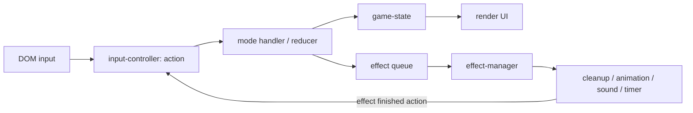
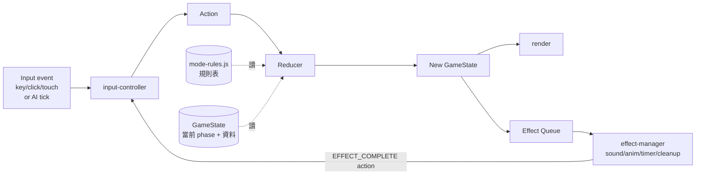
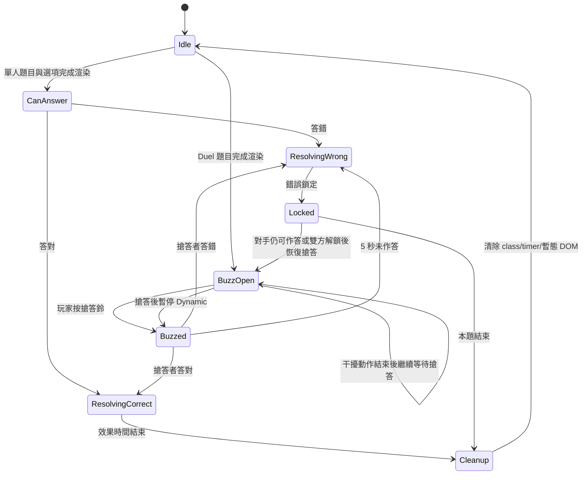
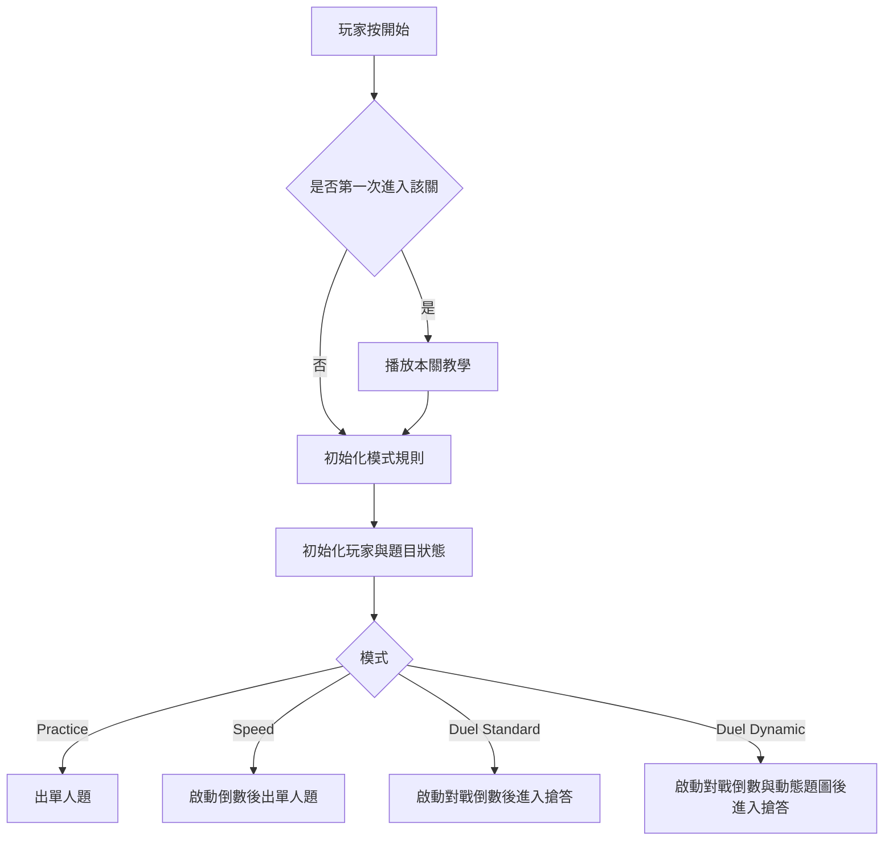
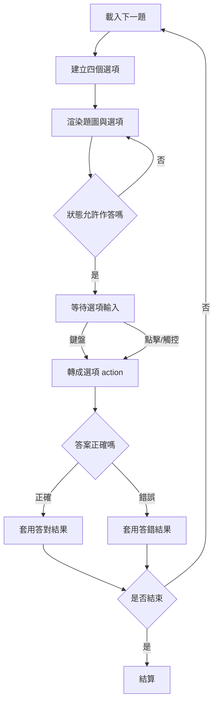
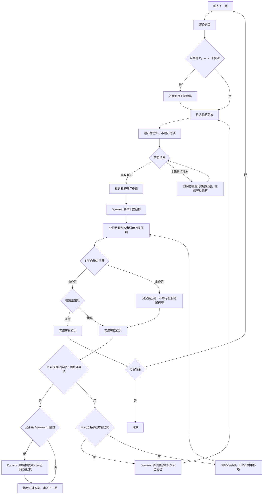

# 有機分類帽 (Organic Sorting Hat)

哈利波特風格的有機化學官能基分類遊戲。玩家看結構式圖片，從四個選項中選出正確的化合物名稱或官能基類別。

本 README 的前半段是目前共識規格，作為後續重構依據；下方 Decision Log 保留歷史紀錄，若與本段衝突，以本段為準。

## Data-driven Rewrite Handoff

本 branch 的目標是「乾淨重寫遊戲核心」，不是繼續搬動舊 `game.js`。舊 branch / git 歷史可作為參考與反面教材，但新版實作應以本 README 前半段為準。

### 本輪規格變更摘要（2026-05-17）

- **取消 Speed 模式**。單人玩法只剩 Practice。
- **Duel 只剩 Dynamic 玩法**。Standard 取消；Duel 一律是「搶答 + 視覺干擾」。Dynamic 有多個干擾變體（effect 1 = zoom 為現有，effect 2 以後新增），規則邏輯一致，只有視覺干擾不同。
- **關卡結構改成 2 維雙階段**：難度（初級 / 中級 / 高級）為第一階段，主題子關為第二階段。原本的 Level 1~6、龜殼、Level 99 由新結構取代或歸入。
- **新規格優先**：本段以及下方「核心目標 → 模式參數」是規格來源；Decision Log 的歷史內容（含 Speed、Duel Standard 的描述）保留作為背景紀錄，但已不再實作。

### 為什麼要重寫

舊版主要問題不是單一 bug，而是架構混雜：

- 規則、UI、動畫、timer、存檔與輸入判定混在 `game.js`。
- 多數流程靠 `if (currentMode === ...)` 分支修補，模式越多越容易互相污染。
- DOM class 與 animation timing 曾經實際影響規則判定，導致答對 / 答錯 / 搶答 / cleanup 狀態殘留。
- Duel Dynamic 的「干擾效果完成」曾被誤寫成「時間到顯示答案」，這類錯誤代表流程狀態沒有資料化。

新版核心原則：

```text
UI 不決定規則。
動畫不決定規則。
timer 不決定勝敗。
規則只看 state + rules + action。
```

### 要保留的東西

- `data.js`：保留題庫內容，但要擴充以支援新關卡結構（中文類別答案、子關分組）。
- `assets/`：保留題圖與素材。
- `story.js`：保留劇情文本，可日後資料化。
- `tutorial.js`：保留教學內容，可日後資料化。
- `save.js`：保留概念與部分 API，但通關 / 統計欄位可重整。
- `mode-rules.js`：保留「模式規則資料化」方向；Speed 規則要移除。
- `game-state.js`：保留「唯一狀態來源」設計。
- `question-engine.js`：保留「抽題、選項、答案判定集中」方向。
- `effect-manager.js`：保留「timer / transient cleanup 集中」方向。
- `input-controller.js`：保留「鍵盤 / 點擊轉 action」方向。
- `README.md` 前半段：作為新版規格來源。

### 不要直接沿用的東西

- 舊 `game.js` 的整體流程。
- 大量 `currentMode` / `duelVariant` if-else 分支作為主要架構。
- 角色選擇流程；目前決定先取消。
- 舊 HP 死亡邏輯；單人玩法不使用血量。
- Speed 模式相關程式碼與資料（倒數計時、時間加減、Q/W/E 快捷鍵）。
- Duel Standard 相關程式碼與資料；Duel 一律走 Dynamic 流程。
- Duel / Dynamic 舊 timer 實作；Dynamic 應以 `completeState` 判定干擾效果是否完成。
- 答錯時隨機選一個錯誤選項來模擬逾時；逾時只算作答失敗，不揭露任何選項資訊。

### 建議的新檔案責任

```text
data.js
  題庫、答案、關卡 metadata。只放內容資料，不放玩法流程。
  包含三套答案：中文化合物名（中級）、中文官能基類別（初級）、英文官能基類別（高級）。

mode-rules.js
  Practice / Duel Dynamic 的模式規則資料；Dynamic 變體（effect 1, effect 2 ...）也在此。

game-state.js
  唯一狀態來源：mode、phase、currentQuestion、activePlayer、locks、effectComplete。

question-engine.js
  抽題、選項生成、答案判定、錯題 / 未出題題池。需支援依難度切換答案類型（compound / categoryZh / categoryEn）。

input-controller.js
  鍵盤、滑鼠、觸控轉成 action。不得直接改分數或 DOM。

mode-handlers/
  practice.js
  duel-dynamic.js
  每個 handler 接收 action + state + rules，回傳 state transition 與 effects。

effect-manager.js
  音效、動畫、timer、cleanup。只能執行效果，不決定規則。

game.js
  初始化、DOM event binding、dispatch action、呼叫 render。不要成為規則中心。
```

### 理想資料流



### Action 優先於事件

新版不應讓 click / keydown 直接跑玩法。輸入應先轉成 action：

```text
START_MODE
LOAD_NEXT_QUESTION
BUZZ
SUBMIT_ANSWER
ANSWER_TIMEOUT
EFFECT_COMPLETE
CONFIRM_RETURN_TO_MENU
RESTART_LEVEL
CONTINUE_PRACTICE
END_ROUND
```

mode handler 決定 action 是否有效。例如：

- `SUBMIT_ANSWER` 在 `phase !== "canAnswer"` 時無效。
- Duel Dynamic 在 `phase === "buzzOpen"` 時只能接受 `BUZZ`，不能接受選項答案。
- `ANSWER_TIMEOUT` 是作答失敗，不等於選錯某個選項。
- `EFFECT_COMPLETE` 只表示動畫或 Dynamic 干擾到達可觀察狀態，不等於顯示答案。

### 重寫時的優先順序

1. 先完成 `GameState` / `Action` / `ModeRules` 文件與資料結構（含取消 Speed、Duel 只剩 Dynamic）。
2. 重整 `data.js`：新增中文類別答案、把題庫掛到「難度 × 主題子關」二維結構上。
3. 實作 `question-engine.js`，讓 Practice 與 Duel 都共用同一套抽題與答案判定。
4. 實作 Practice handler。
5. 實作 Duel Dynamic handler；Dynamic 的干擾效果必須由 `completeState` 控制。effect 1 (zoom) 為第一個變體。
6. 接回現有 UI；必要時才微調 HTML/CSS。

### 新視窗啟動提醒

請先讀本區，再讀「核心目標」到「模式參數」。Decision Log 是歷史，不是新版規格來源。若 Decision Log 與本區衝突，以本區與前半段規格為準。

⚠ **附錄 A 是歷史反面教材，不可作為實作依據**。附錄 A 收錄舊版的 if/else 流程圖，僅保留作為「為什麼這樣寫會壞」的教學材料。若 LLM 或新人引用附錄 A 中的流程做設計，請拒絕並回到前半段的 data-driven 規格。

## 核心目標

- 教學目標優先：幫高中生練習「看結構式辨識官能基」。
- 遊戲回饋要清楚、可預期，不讓動畫或 UI 狀態影響規則判定。
- 所有模式與所有難度都共用同一套題庫圖片與抽題、答案判定核心；差異只由模式規則與「選項類型」決定。

## 模式規格

只有兩種玩法模式：**Practice**（單人練習）、**Duel Dynamic**（搶答對戰）。Speed 與 Duel Standard 已取消。Duel Dynamic 支援兩種對手類型：**PvP**（玩家對玩家）與 **PvE**（玩家對電腦 AI）。

| 模式 | 對手 | 核心目的 | 時間限制 | 作答方式 | 結算目標 |
|---|---|---|---|---|---|
| Practice 單人練習 | 無 | 熟悉題庫與提升正確率 | 無 | 單人四選一 | 答完整關題庫後通關；單輪答對率只作為圖鑑統計 |
| Duel Dynamic | PvP（另一位玩家）或 PvE（電腦 AI 易/中/難） | 搶答加視覺干擾 | 題目干擾動作有生命週期，但不等於答題限時 | 題圖先動態干擾，搶到者才看到選項 | 先達成勝利條件者勝 |

### 模式細則

- **Practice**：不倒數。每輪 10 題，做完後結算本輪答對率；答對率不決定通關。通關條件是把該關（子關）題庫中的所有題目都至少作答過一次。結算後可選擇繼續練習剩餘未出題目，並混入本輪答錯題目，或離開關卡。**Practice 不引入 AI 搶答**，定位是無壓力學習。
- **Duel Dynamic**：搶答鈴 + 5 秒作答權 + 視覺干擾。未搶到作答權的玩家不能選答案；若搶到者答錯，搶到者進入冷卻，作答權交給對手。題目圖片進入搶答開放期時開始播放干擾動作（如 zoom），玩家按搶答鈴後干擾暫停。Dynamic 一定有干擾效果，但效果有多個變體（effect 1 = zoom，為現有；effect 2 為未來新增），每個變體都必須定義 `completeState`；變體之間玩法邏輯一致，只有視覺干擾不同。
- **Duel Dynamic 對手類型**：
  - **PvP**：兩位人類玩家，輸入規格見「輸入規格」段。
  - **PvE**：玩家對電腦 AI。AI 是純前端 JavaScript（無外部 API、無網路請求），透過跟人類完全一樣的 action 介面送 `BUZZ` 與 `SUBMIT_ANSWER`，不允許直接讀寫 state 或 DOM。AI 規則邏輯與 PvP 完全相同，**只有輸入來源不同**；不得讓 AI 享有任何規則上的特權或繞過。
  - AI 難度影響三個參數：**buzz window**（效果播放進度的哪個比例區間才搶答）、**think time**（搶到作答權後的隨機思考時長範圍）、**accuracy**（作答正確率）。詳細預設值見「模式參數」段；可在設定畫面即時調整。

### 進入關卡的步驟（純序列、無分支）

進關不是用 if/else 決策樹寫的，是一串純步驟，分支只發生在資料查表：

1. 玩家在選單選定 `(mode, level, difficulty, opponent)`，dispatch `START_MODE` action（附這四個欄位）。
2. 查 `Save.isLevelTutorialSeen(level, difficulty)`；未看過則 push `effect: showTutorial(level)`，等 `TUTORIAL_DONE` action 再繼續。
3. 載入 `ModeRules.get(mode)` 與 `QuestionSets[level][difficulty]`。`mode` 只有 `practice` 或 `duel`，查表就好，不寫 `if (mode === 'practice')`。
4. 由 `question-engine.buildRoundQueue()` 產出題序。
5. `GameState.createState({mode, level, difficulty, players, opponent})` 建立初始狀態，`phase = idle`。
6. dispatch `LOAD_NEXT_QUESTION`。後續流程進入「答題流程」的 reducer 表。

舊的「模式選擇流程圖」（含 `{是否第一次}` `{模式}` 分支）已移到附錄 A，**不再作為實作依據**。

## 題目與關卡

題目以圖片為核心（化合物結構式 SVG），每題四個單選標籤。題庫圖片共用同一套，但**選項類型**依「難度」決定。Practice 採「難度 × 主題子關」二維雙階段選單；Duel Dynamic 共用題庫但選項類型暫定為中級（中文化合物名稱），未來可允許玩家挑難度。

### 難度層級（決定選項類型）

| 難度 | 題目 | 選項 | 範例題目 → 選項 |
|---|---|---|---|
| 初級 Beginner | 結構式圖片 | 中文官能基類別（烷類、烯類、醇、酮…） | 乙醇結構 → 「醇」 |
| 中級 Intermediate | 結構式圖片 | 中文化合物名稱（甲烷、乙醇、苯甲酸…） | 乙醇結構 → 「乙醇」 |
| 高級 Advanced | 結構式圖片 | 英文官能基類別（Alkane, Alcohol, Ketone…） | 乙醇結構 → 「Alcohol」 |

### 主題子關（決定題庫範圍）

選單先選難度、再選主題子關。同一套題庫圖片在不同難度下複用，只是選項類型不同。

| 子關 | 難度可選 | 題庫範圍 |
|---|---|---|
| 碳氫骨架 | 初、中 | 烷、烯、炔、芳香烴 |
| 含氧家族 | 初、中 | 醇、醚、醛、酮、酸、酯、酚 |
| 含氮 / 鹵化物 | 初、中 | 胺、鹵化物 |
| 綜合 | 初、中 | 上述所有家族混合 |
| 龜殼之地 | 中 | 苯環陷阱題：全是含苯環化合物，要看苯環上接什麼官能基（單一陷阱情境，不另開初級版本） |
| 全題庫英文挑戰 | 高 | 全題庫，選項一律為英文類別（取代原 Level 99） |

子關劃分屬於 `data.js` 的內容資料；上表為目前方向，實際分組數量與名稱以實作時 `data.js` 為準。Duel Dynamic 也從同一套題庫抽題；其使用的難度與是否可選由玩家設定。

### data.js 新結構（spec — 重寫依據）

舊版 `data.js` 把題目硬編碼成 `Level1_List` … `Level99_List` + `QuestionSets[level]`，導致 (a) 不同難度要重列同一張圖、(b) 加新家族 / 新難度都要動結構。新版採用「題圖庫 × 家族篩選 × 難度查表」三層拆分，題圖只列一次。

#### 1. AnswerBank — 答案選項資料庫

每個答案有明確 `type`，方便 `question-engine` 依難度挑對的答案池：

```js
const AnswerBank = {
  // type: "compound" — 中文化合物名稱（中級用）
  "methane":  { type: "compound", content: "甲烷",  category: "alkane" },
  "ethanol":  { type: "compound", content: "乙醇",  category: "alcohol" },
  "benzene":  { type: "compound", content: "苯",    category: "aromatic" },
  // …其餘現有 compounds 全部遷移、加上 type:"compound"

  // type: "categoryZh" — 中文官能基類別（初級用，全新）
  "CAT_ZH_ALKANE":     { type: "categoryZh", content: "烷類",   category: "alkane" },
  "CAT_ZH_ALKENE":     { type: "categoryZh", content: "烯類",   category: "alkene" },
  "CAT_ZH_ALKYNE":     { type: "categoryZh", content: "炔類",   category: "alkyne" },
  "CAT_ZH_ALCOHOL":    { type: "categoryZh", content: "醇",     category: "alcohol" },
  "CAT_ZH_ETHER":      { type: "categoryZh", content: "醚",     category: "ether" },
  "CAT_ZH_ALDEHYDE":   { type: "categoryZh", content: "醛",     category: "aldehyde" },
  "CAT_ZH_KETONE":     { type: "categoryZh", content: "酮",     category: "ketone" },
  "CAT_ZH_CARBOXYLIC": { type: "categoryZh", content: "羧酸",   category: "carboxylic" },
  "CAT_ZH_ESTER":      { type: "categoryZh", content: "酯",     category: "ester" },
  "CAT_ZH_AMINE":      { type: "categoryZh", content: "胺",     category: "amine" },
  "CAT_ZH_HALIDE":     { type: "categoryZh", content: "鹵化物", category: "halide" },
  "CAT_ZH_AROMATIC":   { type: "categoryZh", content: "芳香烴", category: "aromatic" },
  "CAT_ZH_PHENOL":     { type: "categoryZh", content: "酚",     category: "phenol" },

  // type: "categoryEn" — 英文官能基類別（高級用，由舊 CAT_* 改名）
  "CAT_EN_ALKANE":     { type: "categoryEn", content: "Alkane",         category: "alkane" },
  "CAT_EN_ALCOHOL":    { type: "categoryEn", content: "Alcohol",        category: "alcohol" },
  // …其餘 13 類照舊內容、key 由 CAT_* 改為 CAT_EN_*
};
```

對應的 13 個 category 值固定為：`alkane, alkene, alkyne, alcohol, ether, aldehyde, ketone, carboxylic, ester, amine, halide, aromatic, phenol`。

#### 2. QuestionImages — 題圖庫（同一張圖只列一次）

```js
const QuestionImages = [
  { src: "assets/images/01_alkane/01_alkane_methane.svg",  compoundKey: "methane"  },
  { src: "assets/images/01_alkane/01_alkane_ethane.svg",   compoundKey: "ethane"   },
  { src: "assets/images/04_alcohol/04_alcohol_ethanol.svg", compoundKey: "ethanol" },
  // …其餘所有題圖，每張圖一筆；category 由 AnswerBank[compoundKey].category 推導，不重複存
];
```

> 路徑沿用舊版資料夾結構（`assets/images/{xx_class}/{xx_class}_{key}.svg`）。

#### 3. Families — 主題子關定義

```js
const Families = {
  hydrocarbon: {
    nameZh: "碳氫骨架",
    imageFilter: { type: "byCategory", categories: ["alkane", "alkene", "alkyne", "aromatic"] },
    difficulties: ["beginner", "intermediate"],
    storyKey: "hydrocarbon",
  },
  oxygen: {
    nameZh: "含氧家族",
    imageFilter: { type: "byCategory",
                   categories: ["alcohol", "ether", "aldehyde", "ketone", "carboxylic", "ester", "phenol"] },
    difficulties: ["beginner", "intermediate"],
    storyKey: "oxygen",
  },
  nitrogenHalide: {
    nameZh: "含氮鹵化物",
    imageFilter: { type: "byCategory", categories: ["amine", "halide"] },
    difficulties: ["beginner", "intermediate"],
    storyKey: "nitrogenHalide",
  },
  mixed: {
    nameZh: "綜合",
    imageFilter: { type: "all" },
    difficulties: ["beginner", "intermediate"],
    storyKey: "mixed",
  },
  shell: {
    nameZh: "龜殼之地",
    imageFilter: { type: "byCompoundKeys", keys: [
      "phenol","o-cresol","m-cresol","p-cresol","catechol","resorcinol",
      "benzyl_alcohol","benzaldehyde","benzoic_acid","aniline",
      "acetophenone","methyl_benzoate","anisole","chlorobenzene",
      "benzene","toluene","styrene","o-xylene","naphthalene"
    ]},
    difficulties: ["intermediate"],
    storyKey: "shell",
  },
  englishChallenge: {
    nameZh: "全題庫英文挑戰",
    imageFilter: { type: "all" },
    difficulties: ["advanced"],
    storyKey: null,  // 不解鎖劇情
  },
};
```

`imageFilter.type` 只有 3 種：`all` / `byCategory` / `byCompoundKeys`。新增其他過濾邏輯前先在 README 補規格。

#### 4. Difficulties — 難度設定（決定選項類型）

```js
const Difficulties = {
  beginner:     { answerType: "categoryZh", aKeyPrefix: "CAT_ZH_" },
  intermediate: { answerType: "compound",   aKeyPrefix: null      },  // 直接用 compoundKey
  advanced:     { answerType: "categoryEn", aKeyPrefix: "CAT_EN_" },
};
```

#### 5. CompoundFacts — 化合物小知識（不變）

維持現有 `{ compoundKey: "一兩句白話描述" }` 結構，內容沿用，不在本次重寫範圍。文案升級走 NotebookLM → 化學老師審核流程，與本次重寫解耦。

#### 6. 派題函式（放 `question-engine.js`，不放 `data.js`）

```js
// 在 question-engine.js
function getQuestionSet(familyKey, difficultyKey) {
  const fam = Families[familyKey];
  const dif = Difficulties[difficultyKey];
  if (!fam || !dif || !fam.difficulties.includes(difficultyKey)) return [];

  const images = QuestionImages.filter(img => {
    const compound = AnswerBank[img.compoundKey];
    switch (fam.imageFilter.type) {
      case "all":            return true;
      case "byCategory":     return fam.imageFilter.categories.includes(compound.category);
      case "byCompoundKeys": return fam.imageFilter.keys.includes(img.compoundKey);
    }
  });

  return images.map(img => ({
    qType: "img",
    qContent: img.src,
    compoundKey: img.compoundKey,
    aKey: dif.aKeyPrefix
      ? dif.aKeyPrefix + AnswerBank[img.compoundKey].category.toUpperCase()
      : img.compoundKey,
  }));
}
```

#### 7. 同一張題圖，三套答案；池不混

設計上一張題圖（compoundKey）會依當前難度查到不同的 aKey 與不同的答案池。這三套答案 **絕對不會在同一題的選項中同時出現**，因為 `generateOptions` 第一條規則就是「同 type」。範例：

| 題圖 | 當前難度 | 查到的 aKey | 顯示文字 | 干擾項池 |
|---|---|---|---|---|
| 甲醇 SVG（compoundKey=`methanol`） | beginner | `CAT_ZH_ALCOHOL` | 「醇」 | 其他 `categoryZh`（醛、酮、醚…） |
| 甲醇 SVG | intermediate | `methanol` | 「甲醇」 | 其他 `compound`（乙醇、丙醇、苯甲醇…） |
| 甲醇 SVG | advanced | `CAT_EN_ALCOHOL` | 「Alcohol」 | 其他 `categoryEn`（Aldehyde, Ketone…） |

`generateOptions` 不允許跨 type 混；初級的選項裡絕不會混入「甲醇」這種中文化合物名。

#### 8. 干擾選項生成（也在 `question-engine.js`）

每題抽 3 個錯誤選項時：

- **同 type**（鐵則）：依當前難度的 `answerType` 限定答案池（categoryZh / compound / categoryEn 三選一）。
- **同 family 優先**：例如題目是醇，干擾項優先抽含氧家族的其他項；不夠才擴張到全部。
- **同題庫範圍優先**：例如龜殼之地的題目，干擾項優先從龜殼之地題庫的其他答案抽。
- **不抽正確答案自己**。

#### 8. 舊欄位刪除清單

| 舊欄位 | 動作 |
|---|---|
| `Level1_List` ~ `Level5_List` | 刪除（內容由 QuestionImages + Families 派生） |
| `Level6_List` | 刪除 |
| `LevelShell_List` | 刪除 |
| `Level99_List` | 刪除 |
| `QuestionSets` | 刪除 |
| `CAT_*`（CAT_ALKANE 等） | rename 為 `CAT_EN_*` |
| `ReferenceTable`（目前空陣列） | 刪除 |

`CompoundFacts` 維持原樣，不動。

## 答題流程

Practice 的題目流程是「先顯示題目與四個選項，再等待作答」。Duel Dynamic 的題目流程是「先顯示題目（含視覺干擾）與搶答鈴，取得作答權後才顯示選項」。

輸入只產生 action，規則層查 reducer 表決定下一個 phase 與 effect，UI 只根據新 state 顯示畫面。在 PvE 模式下，AI 也只能透過 action 介面參與；不允許 AI 跳過搶答 / 作答權 / 冷卻等規則。

### 資料怎麼跑（data-driven 主迴圈）

下面這張圖是**規則層唯一的資料流向**。看不到任何 `if (mode === ...)` —— 因為模式差異是查表得到的：



Reducer 的職責**只有三件事**：(1) 查 `(mode, phase, action)` → 看 action 是否被接受；(2) 套用 `transition` 取得 `nextPhase` 與 state diff；(3) push 對應 effect 到 effect queue。沒有 if-樹，沒有 mode 分支。

### Practice 規則表（reducer 真值表）

`mode = practice` 下，reducer 查這張表。表中每一列就是一筆資料化規則，未列出的 `(phase, action)` 組合一律忽略（記 warning，不改 state）。

| phase 當前 | action | 條件 | phase 之後 | state 變化 | effects |
|---|---|---|---|---|---|
| idle | LOAD_NEXT_QUESTION | queue 還有題 | canAnswer | `question.current = queue.shift()` | `render` |
| idle | LOAD_NEXT_QUESTION | queue 空 + 已全做過 | settling | `result.passed = true` | `render(settle)` |
| canAnswer | SUBMIT_ANSWER | `key === correctKey` | resolvingCorrect | `player.correctCount++`、`combo++`、`seen.add(qKey)` | `sound:correct`、`anim:correctHighlight` |
| canAnswer | SUBMIT_ANSWER | `key !== correctKey` | resolvingWrong | `player.wrongStreak++`、`combo = 0`、`wrongQueue.add(qKey)` | `sound:wrong`、`anim:markChosen`、（提示模式）`render:whyHint` |
| canAnswer | ANSWER_TIMEOUT | (Practice 不倒數，理論上不發) | — | — | warning |
| resolvingCorrect | EFFECT_COMPLETE | round 未結束 | cleanup→idle | clear transient class/timer | `dispatch LOAD_NEXT_QUESTION` |
| resolvingCorrect | EFFECT_COMPLETE | round 結束（10 題） | settling | 計算本輪 stat | `render(settle)` |
| resolvingWrong | EFFECT_COMPLETE | 同上 | 同上 | (Practice 答錯不結束題目，回到 canAnswer 讓玩家再選) | — |
| settling | CONTINUE_PRACTICE | 還有未做題 | idle | rebuild queue（未做題 + 本輪錯題） | `dispatch LOAD_NEXT_QUESTION` |
| settling | END_ROUND | — | — | — | leave to game.js |

### Duel Dynamic 規則表

`mode = duel` 下查這張表。`opponent` 是 `human`/`aiEasy`/`aiMedium`/`aiHard` 之一；reducer **不檢查 opponent**，因為 AI 經由 `input-controller` 送跟人類完全一樣的 action。AI controller 只看到 `phase` 與「自己能不能 act」，不能讀寫 state。

| phase 當前 | action | 條件 | phase 之後 | state 變化 | effects |
|---|---|---|---|---|---|
| idle | LOAD_NEXT_QUESTION | queue 有題 | buzzOpen | `question.current = queue.shift()`、`eligible = {p1,p2}` | `render`、`anim:startDynamic(variant)` |
| buzzOpen | BUZZ | `player ∈ eligible` | buzzed | `buzz.owner = player`、`timer = 5s` | `anim:pauseDynamic`、`render:showOptions(player)`、`timer:answerOwnership(5s, ANSWER_TIMEOUT)` |
| buzzOpen | DYNAMIC_COMPLETE | — | buzzOpen | `dynamic.completeStateReached = true` | `render:freezeAtCompleteState` |
| buzzed | SUBMIT_ANSWER | `key === correctKey` | resolvingCorrect | `player.correctCount++`、`combo++` | `sound:correct`、`timer:clear` |
| buzzed | SUBMIT_ANSWER | `key !== correctKey` | resolvingWrong | `eliminatedWrongKeys.add(key)`、`failedThisCycle.add(player)` | `sound:wrong`、`anim:markChosen`、`timer:clear` |
| buzzed | ANSWER_TIMEOUT | — | resolvingWrong | `failedThisCycle.add(player)` （**不** add 到 eliminatedWrongKeys） | `sound:timeout` |
| resolvingCorrect | EFFECT_COMPLETE | `correctCount < winTarget` | cleanup→idle | clear transients | `dispatch LOAD_NEXT_QUESTION` |
| resolvingCorrect | EFFECT_COMPLETE | `correctCount == winTarget` | settling | `winner = player` | `render(settle)` |
| resolvingWrong | EFFECT_COMPLETE | `eliminatedWrongKeys.size == 3` | revealing | — | `anim:playDynamicToCompleteState` |
| resolvingWrong | EFFECT_COMPLETE | `failedThisCycle == {p1,p2}` | buzzOpen | `eligible = {p1,p2}`、`failedThisCycle.clear()` | `anim:resumeDynamic` |
| resolvingWrong | EFFECT_COMPLETE | 否則 | buzzed | `buzz.owner = otherPlayer`、`eligible = {otherPlayer}`、`timer = 5s` | `anim:lockoutLoser`、`render:showOptions(other)` |
| revealing | EFFECT_COMPLETE | `dynamic.completeStateReached` | cleanup→idle | reveal correctKey | `anim:revealCorrect`、`dispatch LOAD_NEXT_QUESTION` |

> **規則的真實來源是 `mode-rules.js` 裡的這兩張表**（用 JS object / Map 表達）。reducer 只是 `rules[mode][phase][action]` 查表 + 套用。任何要新加的玩法（例如 effect 2、AI 變難）不應改 reducer，只應新增 rule 列或調 mode-rules.js 的數值。

### 規則層不變式（直接針對歷史 bug）

舊版常見的兩種壞法：**動畫播放一半被新效果擠掉**、**Dynamic 不知道怎麼接續**。下列不變式由 data-driven 架構保證，重寫時必須維持：

**I-1 phase 是唯一的權威，未列在規則表的 (phase, action) 一律忽略**
- `resolvingCorrect` / `resolvingWrong` / `revealing` / `cleanup` 這幾個 phase 在表上**只接受 `EFFECT_COMPLETE`**。動畫中收到 `SUBMIT_ANSWER` / `BUZZ` → reducer 不寫 state、只記 warning。

**I-2 globalInputLocked 由 phase 推導，禁止手動 set/unset**
- `globalInputLocked = phase ∈ {resolvingCorrect, resolvingWrong, revealing, cleanup}`。在這些 phase 下，input-controller 連 action 都不要產生（在 IC 層先擋一道，更節省）。

**I-3 EFFECT_COMPLETE 必須帶 effectId，過期的會被丟掉**
- effect-manager 派出 effect 時生 `effectId`，cleanup 時把已取消的 effectId 列入黑名單。後到的 `EFFECT_COMPLETE(effectId=舊)` 在 reducer 入口就被 drop。**沒有「動畫早就被取消但 callback 還在跑」的鬼魂事件**。

**I-4 下一題只能由 EFFECT_COMPLETE → dispatch(LOAD_NEXT_QUESTION) 觸發**
- 不准任何 `setTimeout(() => loadNextQuestion(), 1500)`。下一題的時機是「上一個效果結束」這個事件，不是「過了一段時間」。

**I-5 Dynamic 狀態完全資料化，接續位置是 elapsedMs 不是 DOM**
- `dynamic = { variant, phase: inactive|playing|paused|playingToComplete|completed, elapsedMs, completeStateReached }`。
- `PAUSE_DYNAMIC` → effect-manager 寫回當下 `elapsedMs`。`RESUME_DYNAMIC` → 從 `elapsedMs` 接著播。即使 DOM 被換掉、重 mount、resize，接續仍然正確。

**I-6 揭示答案的前置條件是 completeStateReached，不是時間**
- Reducer 表 `resolvingWrong → revealing` 的 effect 是 `PLAY_TO_COMPLETE`，不是 `revealCorrect`。effect-manager 播到 `completeState` 才送 `DYNAMIC_COMPLETE`，reducer 收到才轉 `revealing`。**沒有「等 1.5 秒應該到了吧」的猜測**。

**I-7 cleanup 是一個 phase，不是一個函式呼叫**
- 進入 `cleanup` phase 時，effect-manager 自動跑統一清理（取消 timer、清 transient class、移除暫態 DOM、effectId 列黑名單）。清完才能 `→ idle`。任何「我這裡多 call 一次 cleanup() 比較保險」式的祈禱程式碼禁止出現。

**I-8 規則表不檢查「玩家是人還是 AI」**
- AI 透過 input-controller 送跟人類一樣的 action，reducer 完全看不出差別。任何「if (player.isAI) ...」式的特殊路徑禁止出現。

舊的「答題流程」與「Duel 搶答流程」mermaid（含 `{答案正確嗎}` `{5 秒內是否作答}` 等決策框）已移到附錄 A，**不再作為實作依據**。

<!--
舊版單一答題流程保留在 git 歷史中。Duel Dynamic 不可先顯示選項，否則會破壞「觀察題目後搶答」的設計。
-->

## 效果生命週期

答對、答錯、搶答、鎖定、攻擊、提示都必須有明確生命週期。任何新題開始前，上一題的暫態效果必須清除。



### 答對效果規格

- 立即標示正確選項。
- 播放答對音效一次。
- 更新 `correctCount`、`correctStreak`、`round.score`（comboLevel 由 render 從 `correctStreak` 算，不存進 state）。
- 效果結束後才進入下一題或結算（透過 `EFFECT_COMPLETE` 觸發；見不變式 I-4）。
- 下一題開始前必須清除正確高亮與所有暫態動畫（透過 cleanup phase + effect-manager blacklist；見 I-3 / I-7）。

### 答錯效果規格

- 所有模式預設只標示玩家選錯的選項，不亮起正確答案。
- Practice 可用文字提示說明辨識方向；Duel 只標示該次作答失敗（不揭露其他資訊）。
- 只有同題達到最大錯誤次數、或未來某模式明確設定 `revealCorrectOnWrong: true` 時，才揭示正解。
- 播放答錯音效一次。
- 根據模式套用鎖定、提示或懲罰。
- 鎖定期間不可重複作答。
- 鎖定結束或新題開始前必須清除錯誤高亮、正解提示、警告文字與鎖定 class。
- 若是 Duel 搶答後 5 秒未作答，僅記為作答失敗與冷卻，不得隨機標示某個錯誤選項，也不得透露哪個選項錯。
- 未作答逾時不算選錯某個選項；只有玩家（或 AI）實際選到錯誤選項時，才計入「已排除錯誤選項」。

### Combo / Streak 規格

#### 狀態欄位（去除冗餘）

- 只保留 **`correctStreak`** 與 **`wrongStreak`**；舊版 `combo` 欄位廢除（與 `correctStreak` 同義，造成兩處寫入容易不同步）。
- `correctStreak` 跨題累積，遇到「答錯 / 逾時 / 重開 / 回主選單 / 結算」歸零。
- `wrongStreak` 跨題累積，答對時歸零。供 Practice 連錯提示用。
- comboLevel 是 **derived value**（不存進 state、不入 reducer），由 render 從 `correctStreak` 算：

```text
comboLevel(correctStreak) =
  correctStreak >= 8 ? 'brilliant' :
  correctStreak >= 5 ? 'great'    :
  correctStreak >= 3 ? 'good'     :
                       'none'
```

#### 觸發效果（只能視覺 / 音效，不影響規則）

| 連對 | 等級 | Practice | Duel |
|---|---|---|---|
| 1–2 | none | 一般答對特效（綠色閃 + 浮字 `+1`） | 同左 |
| 3–4 | good | 分類帽說「Good!」+ 小星星 | 同左 + 對手 HUD 出現「Opponent on streak: 3」小提示（不晃） |
| 5–7 | great | 分類帽說「Great!」+ 較多星星 + 短音效 | 同左 + 對手 HUD 略微晃動（CSS 動畫，不擋輸入） |
| 8+ | brilliant | 「Brilliant!」+ 粒子（禁止全螢幕爆閃） | 同左 + 對手 HUD 較強晃動 + 粒子飄向對手側（規則零影響） |

#### Combo 對對手的影響（Duel）

- 只影響對手側的 **HUD 視覺**（晃動、提示文字、粒子飄向對手側）。
- **不**改變對手能不能搶答、不縮短搶答倒數、不鎖任何選項。
- 對手的 input-controller 完全不受影響；即使視覺正在晃，按鍵仍正常產生 action。
- 動畫由 effect-manager 派出、有 effectId、被 cleanup 取消時不會留殘影。

#### 不變式

- combo 影響 **0 個** reducer 規則。任何 `if (comboLevel === 'brilliant') ...` 的特殊規則禁止出現。
- combo 由 render 算 + 由 effect-manager 派動畫；reducer 完全不知道 comboLevel 存在。
- 答錯瞬間：reducer 把 `correctStreak = 0`，下一幀 render 算出 comboLevel='none'，cleanup effect 取消所有 combo 動畫。
- Practice 連錯：`wrongStreak` 達門檻時，**只**觸發 hint 顯示，**不**造成玩家死亡（Practice 無死亡）。

### 搶答效果規格

- Duel Dynamic 進入搶答期前，任何答案選項都不可直接作答。
- 第一個有效輸入者（人類或 AI）取得作答權。
- 搶到者才看到選項並可作答；另一位玩家 / AI 不可作答。
- 若搶到者答錯，該玩家進入冷卻，作答權交給對手。
- 玩家或 AI 按下搶答鈴後，題目干擾動作暫停；若該玩家 / AI 答錯或 5 秒未作答，作答權自動交給對手，Dynamic 仍維持暫停。
- 若對手也答錯或 5 秒未作答，且尚未達到本題揭示門檻，Dynamic 繼續播放並恢復完全搶答，兩邊都可再次按搶答鈴。
- 錯誤選項排除狀態由雙方共享；任一方實際選錯某個選項後，該選項視為本題已排除。
- 同一題若已排除 3 個錯誤選項，需先讓干擾動作播放到完成或可觀察狀態，再揭示正確答案並進入下一題。
- 干擾動作結束後，不顯示答案；題目停在可觀察狀態，繼續等待搶答。

### Dynamic 干擾規格

- Dynamic 是 Duel 的視覺變體分類，不是一個固定等於 zoom 的玩法。
- 每個 Dynamic 變體都必須定義 `completeState`，代表玩家已能完整觀察題目。
- 例：effect 1 (zoom) 的 `completeState` 是圖片已 zoom out 到能看到完整結構。effect 2 待定。
- 當需要揭示正確答案時，Dynamic 必須先到達 `completeState`，再揭示答案。
- 變體之間規則邏輯一致；增加新變體不應修改規則層，只應在 `mode-rules.js` 的 Dynamic 變體資料中新增一筆。

## UI 與規則邊界

- 規則狀態以資料為準，例如 `currentMode`、`players[player].state`、`buzz.phase`、`question.current`。
- DOM class 只能反映狀態，不能成為規則來源。
- `setTimeout` 只能負責效果生命週期，不能單獨決定遊戲勝敗。
- 新題開始、重開關卡、回主選單、結算時，都必須走統一 cleanup。
- UI 渲染函式只接受狀態並畫畫面，不直接改變勝敗、解鎖、分數或存檔。
- 在任何答對 / 答錯 / 揭示答案 / 切題動畫期間，必須啟用全局輸入鎖定，封鎖所有答題鍵與點擊，直到新題目準備就緒。
- 全局輸入鎖定期間不接受答題輸入；若玩家按 `Esc`，只開啟暫停 / 確認離開，不直接離開遊戲。
- 重開本關或返回大廳都屬於破壞目前題目流程的動作，必須先確認；確認後才執行 cleanup 並切換畫面。
- 顯示確認視窗期間，timer、Dynamic 干擾動作與作答倒數都必須暫停；取消確認後，恢復到原本狀態。
- 玩家按 `Esc` / `M` 時，跳出「確定返回大廳？」確認視窗；選確認才 cleanup 並返回大廳，選取消則回到剛剛的遊戲狀態。

### UI 結構

UI 是「規則層 state 的視覺投影」。下面列出所有螢幕、它們 render 要讀的 state、以及 state → class 的對照。視覺細節（顏色、字體、間距）以 `style.css` 為真相；本段只規範「render 該畫什麼資料」與「class 該對應哪個 state」。

#### 螢幕清單

| 螢幕 | 觸發 | 退出 |
|---|---|---|
| 主選單（雙階段第一層） | 進站、按 `Esc`/`M` 從遊戲回來 | 按 `1`–`4`、`T`、`C`、`H` |
| 主題子關選擇（雙階段第二層） | 從主選單選初/中級或 Duel | 按子關鍵或 `Esc` 返回主選單 |
| 教學畫面 | 首次進入該子關（家族 × 難度） | 看完最後一頁、按 Esc 跳過 |
| 遊戲畫面 — Practice | START_MODE(practice, ...) | settle / Esc 確認 |
| 遊戲畫面 — Duel PvP | START_MODE(duel, ..., opponent=human) | settle / Esc 確認 |
| 遊戲畫面 — Duel PvE | START_MODE(duel, ..., opponent=aiEasy/Medium/Hard) | settle / Esc 確認 |
| 結算畫面 | phase=settling | `N`/`R`/`S`/`T`/`Esc`/`M` |
| 圖鑑 — 家族卡列表 | 主選單 `C` | Esc |
| 圖鑑 — 家族卡詳細 | 點某張家族卡 | Esc |
| 圖鑑 — 分子小卡 | 點家族卡內某分子 | Esc |
| 設定（玩家 / 存檔 / 開發者選項） | 主選單 → 設定 | Esc |
| Confirm Modal（返回大廳 / 重開本關） | Esc / R 觸發 | 確認或取消 |

#### 各遊戲螢幕 render 要讀的 state

| 螢幕 | 來源 state | 主要元素 |
|---|---|---|
| Practice | `mode, level{family,difficulty}, question.current, question.options, players.p1, phase, hint, round.{index,size,score}` | 題圖、4 選項、分數、本輪進度、提示泡泡（按 H 切換） |
| Duel PvP / PvE | 上列再加 `players.p2, buzz.{phase,owner,eligible,timer}, dynamic.{variant,phase,elapsedMs,completeStateReached}, question.eliminatedWrongKeys, question.failedPlayersThisCycle` | 兩邊計分與作答權、搶答鈴、5 秒倒數、Dynamic 容器（zoom 比例由 elapsedMs 推導）、被排除的選項視覺、PvE 顯示「AI: Hard」標籤 |
| 結算 | `result.{winner?, passed?, accuracyThisRound, roundCount}, badgesEarned[]` | 結果文字、本輪統計、新解鎖徽章 toast、下一步按鈕（N/R/S/T/Esc）|
| 圖鑑家族卡 | `Save.familyProgress[familyKey].{difficulty.{completedAll, masteryAccuracy}}` | 徽章區（🥉🏆 × 難度位）、家族內分子縮圖 |
| 圖鑑分子小卡 | `Save.molecule[compoundKey].{seenIn:Set, correctIn:Set}, CompoundFacts[compoundKey]` | 結構式、中文名、英文名、化學式、小知識、3 個「初/中/高」小印章 |

#### state → class 對照（render 唯一允許做的對應）

render 只能根據 state 加 / 移 class；**class 不准影響規則**（class 是結果，不是輸入）。

| state 條件 | DOM target | class |
|---|---|---|
| `phase === 'resolvingCorrect'` | `body` | `phase-resolving-correct` |
| `phase === 'resolvingWrong'` | `body` | `phase-resolving-wrong` |
| `phase === 'revealing'` | `body` | `phase-revealing` |
| `phase === 'cleanup'` | `body` | `phase-cleanup` |
| `globalInputLocked` (= phase ∈ {resolving*, revealing, cleanup}) | `body` | `input-locked` |
| `mode === 'practice'` | `#game` | `mode-practice` |
| `mode === 'duel' && opponent === 'human'` | `#game` | `mode-duel mode-duel-pvp` |
| `mode === 'duel' && opponent.startsWith('ai')` | `#game` | `mode-duel mode-duel-pve` |
| `dynamic.variant === 'zoom'` | `#question-image` | `dyn-zoom` |
| `dynamic.phase === 'playing'` | `#question-image` | `dyn-playing` |
| `dynamic.phase === 'paused'` | `#question-image` | `dyn-paused` |
| `dynamic.phase === 'playingToComplete'` | `#question-image` | `dyn-completing` |
| `dynamic.completeStateReached` | `#question-image` | `dyn-complete` |
| `buzz.phase === 'open'` | `#duel-area` | `buzz-open` |
| `buzz.owner === 'p1'` | `#duel-area` | `buzz-owner-p1` |
| `buzz.owner === 'p2'` | `#duel-area` | `buzz-owner-p2` |
| `players.p1.isLocked` | `.player-area[data-player="p1"]` | `locked-area` |
| `players.p2.isLocked` | `.player-area[data-player="p2"]` | `locked-area` |
| `option.key ∈ eliminatedWrongKeys` | `.option-btn[data-key="${k}"]` | `eliminated` |
| `option.key === lastChosenWrongKey` | `.option-btn[data-key="${k}"]` | `wrong-chosen` |
| `phase === 'revealing' && option.key === correctKey` | `.option-btn[data-key="${k}"]` | `correct-reveal` |

#### Render 鐵則

- render 只讀 state，**不寫 state、不發 action**。
- 加 class 是「state 已是某值，所以套這個 class」；不可「我先加 class，再 setTimeout 改 state」。
- 動畫 timing 由 CSS（持續時間）+ effect-manager（生命週期）控制；render 不管時間。
- 任何 `setTimeout` 不准出現在 render；要做動畫等待，由 effect-manager 派出 effect、結束時送 `EFFECT_COMPLETE`。
- render 函式必須是冪等的：同一個 state 跑兩次 render，DOM 結果一致。

### Cleanup 定義

Cleanup 是「清除暫態狀態」，不是一個玩法決策。它不等於放棄本題、跳下一題或離開遊戲；實際去向由呼叫 cleanup 的流程決定。

Cleanup 必須清除：

- 尚未完成的 `setTimeout` / interval。
- 答對、答錯、揭示答案、冷卻、搶答、Dynamic 暫停等暫態 class。
- 臨時 DOM，例如倒數、警告、攻擊特效、提示泡泡。
- 玩家暫態鎖定，例如 `globalInputLocked`、單一玩家冷卻、作答權狀態。

Cleanup 之後可能接：

- 下一題。
- 結算畫面。
- 重開本關。
- 返回大廳。

## 通關、進度與存檔規則

- Practice 是唯一會解鎖劇情、影響圖鑑與徽章的模式。
- Practice 每輪 10 題；本輪答對率需記錄，並在圖鑑中可查看，但不作為通關門檻。
- Practice 通關條件是「該子關（家族 × 難度）題庫中的所有題目都至少作答過一次」；通關後解鎖該子關的「完成徽章」與該家族的劇情（劇情以家族為單位，跨難度共享）。**`devQuickWin.enabled = true` 時，達 `devQuickWin.winAfter`（預設 2）也算結算 + 通關**（見「設定與開發者選項」段）。
- **「作答過一次」追蹤要跨輪持久化**，靠 `Save.askedHistory[family-difficulty]: Set<compoundKey>`，而不是只看本輪 `state.seenInRound`。每次 `LOAD_NEXT_QUESTION` 把 `state.question.current.compoundKey` 推進 askedHistory。通關判定為 `askedHistory.size === QuestionEngine.getQuestionSet(family, difficulty).length`。
- **`moleculeSeen` vs `askedHistory` 的分工**：
  - `moleculeSeen[compoundKey][difficulty]`：玩家**答對過**該分子（圖鑑分子小卡的「初/中/高 ✓」小印章用這個）。
  - `askedHistory[family-difficulty]`：該分子在該子關**被問過**（不論對錯；家族卡的「完成 🥉」徽章與通關條件用這個）。
  - 兩者獨立。一張卡可以有「中 ✓」（答對過）但沒有「家族卡完成徽章」（還沒問完所有題）。
- **派題優先順序**（`question-engine.buildRoundQueueV2` 用 `seenSet` 推導）：未在 askedHistory 中的優先 → 本輪錯題其次 → 全題庫補滿到 10 題。一輪 10 題未必全是「未出題」，但**新題會優先被抽**，確保有限輪數內可通關。
- Practice 結算後，玩家可選擇繼續練習：題池包含尚未出現的題目，並加入本輪答錯題目。
- Practice 的單次答對率、題庫完成度、各分子答對紀錄需記錄，並在圖鑑中可查看。
- Duel Dynamic（含 PvE / PvP）答對不計入總答對數、不解鎖圖鑑、不解鎖劇情、不解鎖徽章。
- 總答對數與徽章只統計 Practice，除非未來另行定義。

## 圖鑑與徽章

圖鑑有兩層卡，徽章只屬於家族卡；分子小卡只標「遇過」。

### 家族卡（每個主題子關一張）

家族卡涵蓋：碳氫骨架、含氧家族、含氮鹵化物、綜合、龜殼之地、全題庫英文挑戰。每張家族卡上有 0~2 組徽章位（依該家族支援的難度而定）：

| 徽章 | 解鎖條件 | 適用難度 |
|---|---|---|
| 🥉 完成 | 該家族 × 該難度，題庫所有題目至少答對過一次 | 初、中、高（依家族支援） |
| 🏆 精通 | 該家族 × 該難度，最近 1 輪（10 題）答對率 ≥ 80% | 初、中、高（依家族支援） |

範例：
- 「碳氫骨架」家族卡：4 個徽章位（🥉初 🏆初 🥈中 🏆中）。
- 「龜殼之地」家族卡：2 個徽章位（🥈中 🏆中）。
- 「全題庫英文挑戰」家族卡：2 個徽章位（🥇高 🏆高）。

家族卡上同時列出該家族下的分子小卡縮圖，方便玩家查看已遇過哪些分子。

### 分子小卡（每個分子一張，~70 張）

- 內容：結構式 SVG、中文名、英文名、化學式、`CompoundFacts` 小知識、所屬家族。
- 右上角三個小印章：「初 ✓」「中 ✓」「高 ✓」，表示玩家在哪些難度成功答對過此分子（一次答對就點亮，跨難度共享同一張卡）。
- 分子小卡不放完成 / 精通徽章；那是家族卡的職責。

### 全域勳章

跨家族的成就（例：累積答對 100 題、Practice 全家族完成…）放在「勳章」分頁，不放在家族卡上。維持 `save.js` 既有的 `BADGE_DEFS` 概念。

## 錯題回顧 / 錯題本

讓玩家看到自己錯過什麼、可以針對性重練。**Duel 不計入**（Duel 不做教學回饋）。

### 兩個出現位置

| 位置 | 觸發 | 內容 |
|---|---|---|
| **Practice 結算頁的「本輪錯題」區** | phase=settling 時自動顯示 | 本輪 `state.wrongInRound` 內的分子卡片清單；每張顯示題圖縮圖 + 中文名 + 玩家當時選錯的答案（若有，逾時無此欄）+「看圖鑑」按鈕跳到分子小卡 |
| **主選單「錯題本」入口** | 主選單 `W` 鍵或點按 | 跨輪累計的未克服錯題，依「家族 × 難度」分組顯示；每組有「重練這組」按鈕，按下後進 Practice 並只用該組錯題當題庫 |

### 狀態與存檔

**Reducer 層（本輪短暫）**：

- `state.wrongInRound: Set<compoundKey>` — 已存在於 game-state V2，reducer 在答錯 / 逾時時 `add(compoundKey)`；答對該題時不從 `wrongInRound` 移除（本輪錯過就是錯過，「克服」是跨輪概念）。

**Save 層（跨輪持久化）— 擴充 v2 schema**：

```js
// 加進 save.js v2 schema：
wrongLog: {
  // 依「家族 × 難度」分桶
  [`${family}-${difficulty}`]: {
    active: string[],   // 尚未克服的 compoundKey 清單（去重、保序）
    fixed:  string[],   // 後續答對過的 compoundKey 清單（從 active 移到 fixed）
    lastUpdated: number // timestamp
  }
}
```

**規則層的兩個 effect / action（reducer 不直接寫 save，dispatch 由 effect-manager 推）**：

- Practice 答錯或逾時時，reducer 在 stateDiff 加 `state.wrongInRound.add(compoundKey)`，並 push effect `{ type:'saveWrong', family, difficulty, compoundKey }`。effect-manager 將該分子加進 `wrongLog[family-difficulty].active`（若不在 active 中且不在 fixed 中）。
- Practice 答對時，reducer push effect `{ type:'fixWrong', family, difficulty, compoundKey }`。effect-manager 如果該分子在 active，把它從 active 移到 fixed。
- 這兩個 effect 跟 sound/anim 並列，效果完成不需要回 EFFECT_COMPLETE（save 是 fire-and-forget）。

### Save API（補在 wave 4 已 commit 的 save.js v2 之上，game.js 重寫時補上）

```js
Save.recordWrongV2(family, difficulty, compoundKey)
Save.markFixedV2(family, difficulty, compoundKey)
Save.getActiveWrongs(family, difficulty) → string[]      // 給「重練這組」用
Save.getAllActiveWrongs() → { [family-difficulty]: string[] }   // 給「錯題本」總覽用
Save.clearWrongLog(family?, difficulty?) → void          // 重置該組或全部（設定頁用）
```

### 「重練錯題」流程

主選單 → 錯題本 → 點某組「重練這組」按鈕 →
- dispatch `START_MODE(practice, family, difficulty, opponent: 'human', queueSource: 'wrongOnly')`
- reducer 在 idle 時，依 `queueSource === 'wrongOnly'` 用 `Save.getActiveWrongs(family, difficulty)` 篩 `getQuestionSet(family, difficulty)` → 限縮 queue。
- 跟一般 Practice 完全一樣的反應 / 結算流程；答對的會從 active 移到 fixed。
- 若該組全部克服 → 結算頁顯示「🎉 已克服該組所有錯題」+「回主選單」按鈕。

### UI 結構增補

加進「螢幕清單」（接在圖鑑後）：

| 螢幕 | 觸發 | 退出 |
|---|---|---|
| 錯題本（主畫面） | 主選單 `W` | Esc → 主選單 |
| 錯題本（單組詳細 / 重練前確認） | 點某組 | Esc 或「重練這組」 |
| Practice 結算頁的「本輪錯題」區 | 結算頁的子區塊，不獨立螢幕 | 與結算頁一起退出 |

加進「各遊戲螢幕 render 要讀的 state」：

| 螢幕 | 來源 state | 主要元素 |
|---|---|---|
| 結算（Practice） | 既有 + `state.wrongInRound`, `state.family`, `state.difficulty` | 本輪錯題卡片清單；每張卡：題圖、中文名、選錯選項文字（若有）、「看圖鑑」按鈕 |
| 錯題本（總覽） | `Save.getAllActiveWrongs()`, `Families`, `Difficulties` | 依 family-difficulty 分組；每組顯示組名 + active 題數 + 「重練這組」按鈕 |
| 錯題本（單組詳細） | `Save.getActiveWrongs(family,difficulty)`, `AnswerBank`, `QuestionImages` | 該組未克服的分子卡片網格；每張卡：題圖、中文名、英文名、「看圖鑑」按鈕；底部「重練這組（N 題）」 |

### 輸入規格增補

主選單第一階段加：

| 鍵 | 動作 |
|---|---|
| `W` | 進入錯題本 |

（不衝突：當前主選單已用 `1`–`4` 選關 / Duel、`T`/`C`/`H` 教學/圖鑑/分類總表。）

### 驗收清單增補

```
**錯題本與錯題回顧**
- [ ] Practice 答錯一題 → 結算頁本輪錯題區顯示該分子卡
- [ ] Practice 答對 → 不在本輪錯題區
- [ ] Practice 答錯後跨輪 → 錯題本「該家族-該難度」組出現該分子
- [ ] Practice 答對曾錯過的分子 → 錯題本該組少一個（移到 fixed）
- [ ] 主選單按 W → 錯題本主畫面；按 Esc 返回
- [ ] 點某組「重練這組」→ 進入 Practice，題庫只含該組 active 分子
- [ ] 重練該組全部答對 → 結算頁顯示「已克服」
- [ ] Duel 答錯 → 不影響錯題本（Duel 不教學）
- [ ] 設定頁可重置某組或全部錯題本
```

## 模式參數

以下數字是目前新規格，重構時應落實到 `mode-rules.js`，不要沿用舊程式中的歷史值。Speed 相關參數已全部移除（模式取消）。

| 參數 | 目前方向 |
|---|---|
| Practice 每輪題數 | 10 題 |
| Practice 通過正確率 | 無門檻；答對率只作為圖鑑與「精通徽章」統計 |
| Practice 解鎖劇情門檻 | 該家族至少有一個難度通關（題庫全部題目至少作答過一次） |
| Practice 精通徽章門檻 | 該子關（家族 × 難度）最近 1 輪答對率 ≥ 80% |
| Duel 勝利條件 | 先答對 5 題 |
| Duel 作答權倒數 | 5 秒；逾時算作答失敗，不排除選項、不揭露錯誤選項 |
| Duel 答錯懲罰 | 答錯者冷卻，作答權交給對手 |
| Duel 單題揭示門檻 | 已排除 3 個錯誤選項後，Dynamic 播放到完成或可觀察狀態，再給答案 |
| Duel 預設題庫難度 | 中級（中文化合物名）；可允許玩家進入 Duel 時挑難度 |
| Dynamic 干擾變體 | effect 1 = zoom（現有）；effect 2 待定（未來新增）。新增變體只動 `mode-rules.js`，不改 reducer |
| Dynamic 干擾動作結束後 | 題目停止在可觀察狀態，繼續等待搶答，不自動揭示答案 |
| AI Easy | buzz window 85–95%（效果播放進度比例）；思考時間 1500–3000 ms；作答正確率 ~60% |
| AI Medium | buzz window 75–90%；思考時間 1200–2500 ms；作答正確率 ~80% |
| AI Hard | buzz window 70–85%；思考時間 1000–2000 ms；作答正確率 ~95% |
| AI 行為模型 | 三參數：**buzz window**（在效果播放進度的哪個區間隨機搶答）、**think time**（搶到作答權後等多久送出答案）、**accuracy**（答對機率）。參數可在設定 → 開發者 → PvE AI 參數即時調整，不需重啟遊戲。 |
| AI 規則 | 純前端 JS（無外部 API、無網路請求）；只透過 action 介面送 `BUZZ` 與 `SUBMIT_ANSWER`；不得讀寫 state 或 DOM；不得享有任何規則特權 |

## 設定與開發者選項

主選單有「設定」入口，內含：玩家設定（音量、顯示等）、存檔操作（匯出 / 匯入 / 重置）、**開發者選項**。所有設定值存在 `Save.settings`，跨 session 持久。

### 開發者選項（取代舊版隱藏的 backtick toggle）

舊版用按 `` ` `` 鍵切換 `_devQuickWin` 是「埋在 game.js 的隱藏 flag」（見現有 `game.js:183, 2196`）。新版改成設定畫面內可見的開關，分布在「開發者選項」分頁。

| 開關 | 預設值 | 行為 |
|---|---|---|
| `devQuickWin.enabled` | **true**（重寫上線時為 true；正式上線前手動翻 false） | 啟用「答對 N 題即結算」捷徑 |
| `devQuickWin.winAfter` | **2** | 達到此數即結算（通關 / 勝） |
| `devQuickWin.appliesTo` | `['practice', 'duel']` | 套用對象（Practice 提早通關、Duel 提早判定勝者） |
| `devQuickWin.showIndicator` | **true** | 螢幕底部紅色 banner「🔧 測試模式：答對 N 題即結算」 |
| `devShowFps` | false | 右上角顯示 FPS（驗收用） |
| `devLogActions` | false | console.log 每個 action（debug 用） |

### 套用方式（data-driven 不破壞）

`devQuickWin` 是**覆蓋層**，不是規則分支。實作上：

- `mode-rules.js` 的 `DuelDynamicRules.winTarget`、Practice 的 `clearCondition` 由 `getEffectiveRules(state, settings)` 合成：

  ```js
  function getEffectiveRules(baseRules, settings) {
    if (!settings.devQuickWin.enabled) return baseRules;
    return {
      ...baseRules,
      DuelDynamicRules: { ...baseRules.DuelDynamicRules, winTarget: settings.devQuickWin.winAfter },
      practiceClearAfterN: settings.devQuickWin.winAfter,
    };
  }
  ```

- reducer 永遠拿到「合成後」的 rules；handler 不知道 dev 開關存在。
- Practice 的 clear 判斷：handler 內既有的「queue 空 + 全做過」邏輯之外，再加一條「`s.players.p1.correctCount >= effectiveRules.practiceClearAfterN`」也算結算。**這個比對是查 rules 不是查 dev flag**。
- 因此 reducer / handler **零 `if (dev)` 分支**。

### 設定畫面 UI（接到「UI 結構」）

- 螢幕：「設定」獨立頁，主選單 → 設定 進入。
- 分頁：「玩家」（音量、震動、語言）、「存檔」（匯出 / 匯入 / 重置）、「開發者」（上表開關）。
- 「開發者」分頁標題前加紅色標籤「⚠ DEV」提醒這不是正常玩家設定。
- 即時生效（不需重開遊戲）；改動會立刻 `Save.writeSettings()` 並重新 dispatch 一次 `SETTINGS_CHANGED` action，render 重畫。
- `devQuickWin.showIndicator = true` 時，遊戲畫面顯示紅色 banner（沿用舊版位置與樣式）。

### 為什麼預設 ON（目前）

重寫期間需要快速驗收 Practice 通關流程 / Duel 勝負流程 / 結算頁 / 圖鑑徽章解鎖；每次都要答完整關太慢。**正式上線前要手動把 `devQuickWin.enabled` 預設值翻 false**，並加進「上線前 checklist」（見驗收清單）。

## 輸入規格

### 答題輸入

- Practice：滑鼠 / 觸控，或鍵盤 `A/F/Z/C`、數字鍵 / 小鍵盤 `4/6/1/3` 任一組，對應畫面 2x2 選項位置。
- Duel PvP 桌面：P1 使用 `A/F/Z/C`，P2 使用數字鍵 / 小鍵盤 `4/6/1/3`；搶答鈴 P1 用 `Space`、P2 用 `Enter`（具體鍵位在 `input-controller.js` 設定）。
- Duel PvE 桌面：人類玩家固定為 P1，使用 `A/F/Z/C` + `Space` 搶答；P2 由 AI 操作，不佔用鍵位。
- Duel 觸控（PvP）：玩家用上下分割的各自區域點擊或觸控搶答與作答。
- Duel 觸控（PvE）：人類玩家點擊整個遊戲區，AI 在背景操作。

### 遊戲中通用

- `Esc`/`M` 開啟「確定返回大廳？」確認，`R` 開啟重新開始本關確認，`H` 切換 Practice 提示模式。
- 結算畫面：`Enter` 確認目前焦點按鈕，`N` 到下一關，`R` 再次練習，`S` 解鎖/重播劇情，`T` 看本關教學，`Esc`/`M` 返回大廳。

### 主選單（雙階段）

第一階段 — 主選單：

| 鍵 | 動作 |
|---|---|
| `1` | 進入初級 → 第二階段選主題子關 |
| `2` | 進入中級 → 第二階段選主題子關 |
| `3` | 進入高級 → 直接進入「全題庫英文挑戰」 |
| `4` | 進入 Duel Dynamic → 第二階段選對手與難度 |
| `T` | 新手導覽 |
| `C` | 圖鑑 |
| `H` | 看分類總表（若有） |
| 方向鍵 / Enter / Space | 焦點移動與確認 |

第二階段（依第一階段而定）：

- 初級 / 中級：用 `1`–`5` 或方向鍵 + Enter 選主題子關（碳氫骨架 / 含氧家族 / 含氮鹵化物 / 綜合，中級多一個「龜殼之地」）。
- 高級：只有「全題庫英文挑戰」，按 Enter 直接進入。
- Duel：選對手（`1` PvP / `2` PvE 易 / `3` PvE 中 / `4` PvE 難）與題庫難度（預設中級，可在此挑）。

方向鍵可在目前畫面中的按鈕間移動焦點，`Enter`/`Space` 執行。

## 周邊系統

- **分類帽角色**：作為教學與回饋角色，但表情動畫不得控制遊戲規則。
- **新手導覽**：首次進站自動跳出，可在首頁重看。
- **每關分類帽教學**：第一次進該子關（家族 × 難度）先播放，完成後才開始遊戲；可在結算畫面重看。教學「看過」紀錄以子關為單位。
- **提示模式**：只在 Practice 中啟用，答錯時提供辨識提示。
- **圖鑑**：兩層結構（家族卡 + 分子小卡），見「圖鑑與徽章」段。
- **劇情**：以家族為單位；Practice 完成該家族任一難度的全部題庫即解鎖；結算頁可播放。
- **勳章**：分兩類 — (1) 家族卡上的完成 / 精通徽章，依子關記錄；(2) 全域勳章（累積答對門檻等），跨家族統計。Duel 不影響任何勳章。
- **存檔**：自動存在瀏覽器 localStorage，可匯出、匯入、重置。存檔欄位需擴充以容納「子關 × 難度」維度的完成度與精通記錄。

## 重寫工程藍圖

目前 `game.js` 是歷史累積的主控制器（~3289 行）。後續重構目標不是只把檔案切小，而是把規則、狀態、渲染、效果生命週期拆清楚，讓 `game.js` 縮回協調入口的角色（目標 < 800 行）。

### 模組責任總覽

```text
game.js              協調入口：DOM 綁定、dispatch、呼叫 render；不寫規則
mode-rules.js        Practice / Duel Dynamic 的資料化規則（含 reducer 真值表、Dynamic 變體、AI 參數）
game-state.js        玩家、題目、buzz、dynamic、effect blacklist 等狀態的唯一真相
question-engine.js   抽題、選項生成、答案判定；支援 (family, difficulty) 兩維
effect-manager.js    音效、動畫、timer、cleanup；擁有 effectId 與黑名單，發 EFFECT_COMPLETE
input-controller.js  鍵盤 / 滑鼠 / 觸控 / AI 轉成 action；在源頭擋掉 globalInputLocked 期間的輸入
mode-handlers/       reducer + effect 計算的純函式（practice.js / duel-dynamic.js）
ai-controller.js     PvE 用；只送 action，不讀寫 state/DOM
render.js（或先放在 game.js 內）  依 state 畫畫面，不改 state、不發 action
```

### mode-rules.js — reducer 真值表的 JS 表達

reducer 表用 **單層平面 object**，key 是 `'mode.phase.ACTION'` 複合字串，value 是純函式 handler `(state, action, dynRules) => { nextPhase, stateDiff, effects[] }`：

```js
const ModeRules = {
  // ===== Practice =====
  'practice.idle.LOAD_NEXT_QUESTION': (s) => s.queue.length
    ? { nextPhase: 'canAnswer',
        stateDiff: { 'question.current': s.queue[0], 'queue': s.queue.slice(1) },
        effects: [{ type:'render' }] }
    : { nextPhase: 'settling',
        stateDiff: { 'result.passed': true },
        effects: [{ type:'render' }] },

  'practice.canAnswer.SUBMIT_ANSWER': (s, a) =>
    a.key === s.question.correctKey
      ? { nextPhase: 'resolvingCorrect',
          stateDiff: { 'players.p1.correctStreak': s.players.p1.correctStreak + 1,
                       'players.p1.wrongStreak': 0,
                       'players.p1.correctCount': s.players.p1.correctCount + 1,
                       'round.score': s.round.score + 1 },
          effects: [{ type:'sound', name:'correct' },
                    { type:'anim', name:'correctHighlight', ms: 1000 }] }
      : { nextPhase: 'resolvingWrong',
          stateDiff: { 'players.p1.wrongStreak': s.players.p1.wrongStreak + 1,
                       'players.p1.correctStreak': 0,
                       'question.lastChosenWrongKey': a.key,
                       'question.eliminatedWrongKeys': new Set([...s.question.eliminatedWrongKeys, a.key]) },
          effects: [{ type:'sound', name:'wrong' },
                    { type:'anim', name:'markChosen', ms: 800 }] },

  'practice.resolvingCorrect.EFFECT_COMPLETE': (s) => ({
    nextPhase: 'cleanup',
    stateDiff: {},
    effects: [{ type:'cleanupAndDispatch', next: { type:'LOAD_NEXT_QUESTION' } }],
  }),

  'practice.resolvingWrong.EFFECT_COMPLETE': (s) => ({
    nextPhase: 'canAnswer',          // Practice 答錯不結束題目，玩家再選
    stateDiff: {},
    effects: [{ type:'cleanup' }],
  }),

  // ===== Duel Dynamic =====
  'duel.idle.LOAD_NEXT_QUESTION': (s) => ({
    nextPhase: 'buzzOpen',
    stateDiff: { 'question.current': s.queue[0], 'queue': s.queue.slice(1),
                 'buzz.eligible': new Set(['p1','p2']) },
    effects: [{ type:'render' },
              { type:'anim', name:'startDynamic', variant: s.dynamic.variant }],
  }),

  'duel.buzzOpen.BUZZ': (s, a) => s.buzz.eligible.has(a.player)
    ? { nextPhase: 'buzzed',
        stateDiff: { 'buzz.owner': a.player },
        effects: [{ type:'anim', name:'pauseDynamic' },
                  { type:'render', target:'showOptionsTo', player: a.player },
                  { type:'timer', ms: 5000, onTimeout: { type:'ANSWER_TIMEOUT', player: a.player } }] }
    : { nextPhase: 'buzzOpen', stateDiff: {}, effects: [] },  // ignore（同 race 用）

  'duel.buzzOpen.DYNAMIC_COMPLETE': (s) => ({
    nextPhase: 'buzzOpen',
    stateDiff: { 'dynamic.completeStateReached': true, 'dynamic.phase': 'completed' },
    effects: [{ type:'anim', name:'freezeAtCompleteState' }],
  }),

  'duel.buzzed.SUBMIT_ANSWER': (s, a) =>
    a.key === s.question.correctKey
      ? { nextPhase: 'resolvingCorrect',
          stateDiff: { [`players.${a.player}.correctCount`]: s.players[a.player].correctCount + 1,
                       [`players.${a.player}.correctStreak`]: s.players[a.player].correctStreak + 1 },
          effects: [{ type:'sound', name:'correct' }, { type:'timer.clear' }] }
      : { nextPhase: 'resolvingWrong',
          stateDiff: { 'question.eliminatedWrongKeys': new Set([...s.question.eliminatedWrongKeys, a.key]),
                       'question.failedPlayersThisCycle': new Set([...s.question.failedPlayersThisCycle, a.player]),
                       [`players.${a.player}.correctStreak`]: 0 },
          effects: [{ type:'sound', name:'wrong' }, { type:'timer.clear' }] },

  'duel.buzzed.ANSWER_TIMEOUT': (s, a) => ({
    nextPhase: 'resolvingWrong',
    stateDiff: { 'question.failedPlayersThisCycle': new Set([...s.question.failedPlayersThisCycle, a.player]) },
    // 不加入 eliminatedWrongKeys —— 逾時 ≠ 選錯
    effects: [{ type:'sound', name:'timeout' }],
  }),

  'duel.resolvingCorrect.EFFECT_COMPLETE': (s, _, dyn) =>
    s.players[s.buzz.owner].correctCount >= dyn.winTarget
      ? { nextPhase: 'settling',
          stateDiff: { 'result.winner': s.buzz.owner },
          effects: [{ type:'render' }] }
      : { nextPhase: 'cleanup', stateDiff: {},
          effects: [{ type:'cleanupAndDispatch', next: { type:'LOAD_NEXT_QUESTION' } }] },

  'duel.resolvingWrong.EFFECT_COMPLETE': (s, _, dyn) => {
    const eliminated = s.question.eliminatedWrongKeys.size;
    const bothFailed = s.question.failedPlayersThisCycle.has('p1')
                    && s.question.failedPlayersThisCycle.has('p2');
    if (eliminated >= dyn.revealThreshold) {
      return { nextPhase: 'revealing', stateDiff: {},
               effects: [{ type:'anim', name:'playDynamicToCompleteState' }] };
    }
    if (bothFailed) {
      return { nextPhase: 'buzzOpen',
               stateDiff: { 'buzz.eligible': new Set(['p1','p2']),
                            'question.failedPlayersThisCycle': new Set() },
               effects: [{ type:'anim', name:'resumeDynamic' }] };
    }
    const other = s.buzz.owner === 'p1' ? 'p2' : 'p1';
    return { nextPhase: 'buzzed',
             stateDiff: { 'buzz.owner': other, 'buzz.eligible': new Set([other]) },
             effects: [{ type:'anim', name:'lockoutLoser' },
                       { type:'render', target:'showOptionsTo', player: other },
                       { type:'timer', ms: 5000, onTimeout: { type:'ANSWER_TIMEOUT', player: other } }] };
  },

  'duel.revealing.EFFECT_COMPLETE': (s) => ({
    nextPhase: 'cleanup', stateDiff: {},
    effects: [{ type:'anim', name:'revealCorrect', key: s.question.correctKey },
              { type:'cleanupAndDispatch', next: { type:'LOAD_NEXT_QUESTION' } }],
  }),

  'duel.cleanup.CLEANUP_DONE': (s) => ({ nextPhase: 'idle', stateDiff: {}, effects: [] }),
  'practice.cleanup.CLEANUP_DONE': (s) => ({ nextPhase: 'idle', stateDiff: {}, effects: [] }),
};

// Reducer 入口
function reduce(state, action, dynRules) {
  const key = `${state.mode}.${state.phase}.${action.type}`;
  const handler = ModeRules[key];
  if (!handler) {
    console.warn('[reducer] no rule for', key);
    return { nextPhase: state.phase, stateDiff: {}, effects: [] };
  }
  return handler(state, action, dynRules);
}

// Dynamic 變體（與規則表分離；reducer 不直接讀）
const DynamicVariants = {
  zoom: { completeState: 'fullStructureVisible', pauseOnBuzz: true, revealRequiresCompleteState: true,
          durationMs: 8000 /* 從頭播到 completeState 的時間 */ },
  // effect2: { … }  // 未來新增；不改 reducer，只在這裡加一筆
};

// Duel / Dynamic 數值（餵給上面 handler 的 dyn 參數）
const DuelDynamicRules = {
  winTarget: 5,
  answerOwnershipMs: 5000,
  revealThreshold: 3,
};

// AI 難度
const AIDifficulty = {
  easy:   { buzzReactionMs: { mean: 2500, jitter: 500 }, accuracy: 0.60 },
  medium: { buzzReactionMs: { mean: 1500, jitter: 500 }, accuracy: 0.80 },
  hard:   { buzzReactionMs: { mean:  700, jitter: 300 }, accuracy: 0.95 },
};
```

**為什麼選平面複合 key**：

- 一行一條規則，肉眼一行掃完。
- `grep "'duel\\." mode-rules.js` 一指令列出 Duel 全部規則。
- 加新 `(phase, action)` = 加一行，不必開新巢狀層。
- 加新 phase = 不需要重組結構，仍然只加幾行。

**鐵則**：

- handler 必須是純函式：吃 `(state, action, dynRules)`、回 `{nextPhase, stateDiff, effects}`；不可副作用、不可改傳入 state、不可直接 dispatch、不可 `setTimeout`。
- 未列在表中的 `'mode.phase.ACTION'` 一律忽略並記 warning（見上方 reducer 入口）。
- 任何 `if (mode === ...)`、`if (player.isAI)` 都不准出現在 reducer / handler。
- handler 內可以 `if` 在「同一個 phase+action 下，根據 state 條件選不同 transition」（如 SUBMIT_ANSWER 的對 / 錯）；這是查資料、不是模式分支。

### game-state.js — state shape

```js
function createState() {
  return {
    mode: 'practice',                 // 'practice' | 'duel'
    family: 'hydrocarbon',
    difficulty: 'intermediate',       // 'beginner' | 'intermediate' | 'advanced'
    opponent: 'human',                // 'human' | 'aiEasy' | 'aiMedium' | 'aiHard'（只 Duel 用）
    phase: 'idle',
    globalInputLocked: false,         // 由 phase 推導，不手動 set
    queue: [],                        // 本輪剩餘題目
    seenInRound: new Set(),
    wrongInRound: new Set(),
    round: { index: 0, size: 10, score: 0, accuracyThisRound: null },
    question: {
      current: null,                  // { qContent, compoundKey, aKey }
      correctKey: '',
      options: [],                    // [{key, content}]
      eliminatedWrongKeys: new Set(),
      lastChosenWrongKey: null,
      failedPlayersThisCycle: new Set(),
    },
    players: { p1: createPlayerState(), p2: createPlayerState() },  // p2 只 Duel 用
    buzz: { phase: 'idle', owner: null, eligible: new Set(['p1','p2']), timerId: null },
    dynamic: { variant: null, phase: 'inactive', elapsedMs: 0, completeStateReached: false },
    effects: { activeIds: new Set(), blacklistIds: new Set() },     // effectId 追蹤
    result: { winner: null, passed: false, badgesEarned: [] },
  };
}
```

- 所有 `Set` 都是有意義的「無序集合」，序列化（save）時轉 Array。
- `globalInputLocked` 由 selector 推導：`phase ∈ {resolvingCorrect, resolvingWrong, revealing, cleanup}`。**禁止其他地方寫入這個欄位**。

### question-engine.js — API

```js
QuestionEngine.getQuestionSet(family, difficulty) → Array<{qContent, compoundKey, aKey}>
QuestionEngine.buildRoundQueue({ family, difficulty, seenSet, wrongSet, includeUnseen, includeWrong, limit })
QuestionEngine.generateOptions({ correctAKey, answerType, familyScope })  // 回 4 個選項
QuestionEngine.isCorrect(selectedKey, correctKey)
QuestionEngine.answerText(answerKey)
```

`generateOptions` 規則：同 type（categoryZh/compound/categoryEn）、同 family 優先、不抽正確答案自己、不重複。

### effect-manager.js — API & 不變式

```js
EffectManager.run(effect) → effectId         // 啟動一個 effect（sound/anim/timer/cleanupAndDispatch...）
EffectManager.cancel(effectId)               // 取消單一 effect
EffectManager.cancelAll(reason)              // cleanup 用，把所有 active effectId 移到 blacklist
EffectManager.onComplete(effectId) → dispatch({ type:'EFFECT_COMPLETE', effectId })
```

- 每個 effect 有 effectId；effect 結束時送 `EFFECT_COMPLETE(effectId)`。
- Reducer 入口檢查 `state.effects.blacklistIds.has(effectId)` → 是就 drop。
- Dynamic 變體的播放 / 暫停 / 接續用 `EffectManager.run({type:'dynamic', variant, op:'play|pause|resume|playToComplete', startElapsedMs})`，內部用 RAF tick；暫停時把 `elapsedMs` 寫回 state；恢復時讀回。

### input-controller.js — API & 不變式

```js
InputController.init({ dispatch, getState })
// 內部監聽 keydown / click / touch
// 每個事件先檢查 getState().globalInputLocked → 是就丟掉
// 否則轉成 action: dispatch({type:'SUBMIT_ANSWER', key:'methane', player:'p1'})
```

- 在源頭擋一道是為了省 reducer 工作量；reducer 仍然會擋第二道（防 race）。
- AI 不走 keydown，但走同一支 `dispatch`，所以 reducer 不知道差異。

### ai-controller.js — API（PvE 專用）

```js
const ai = new AIController({ difficulty: 'medium', player: 'p2', dispatch, getState });
ai.start();   // 訂閱 phase 變化
ai.stop();    // 離開 Duel 時呼叫
```

行為：

- `getState().phase === 'buzzOpen' && getState().buzz.eligible.has('p2')` →
  `setTimeout(() => dispatch({type:'BUZZ', player:'p2'}), reactionMs ± jitter)`
- `getState().phase === 'buzzed' && getState().buzz.owner === 'p2'` →
  `setTimeout(() => dispatch({type:'SUBMIT_ANSWER', key:pick, player:'p2'}), thinkMs)`
  其中 `pick` 依 `accuracy` 決定：`Math.random() < accuracy ? correctKey : 隨機錯誤選項`
- 任何 `setTimeout` 在 `phase` 離開期望狀態時必須自動取消（避免「我以為要 buzz，但對手已經先 buzz 了」）。
- **不**直接讀 state.question 的細節（只能讀 `phase`、`buzz`、`options`）。

### game.js — 重寫後該長什麼樣

骨架 < 800 行，職責：

1. 啟動：初始化 GameState、ModeRules、Save、InputController。
2. 主選單與選單導航：呼叫 render；接收主選單 action（START_MODE 等）。
3. `dispatch(action)` 主循環：呼叫 reducer 查表、套用 stateDiff、把 effects 丟給 EffectManager、呼叫 render。
4. cleanup phase 進入時，呼叫 `EffectManager.cancelAll('cleanup')` 並走統一清除流程。
5. PvE 時，建立 `AIController` 實例並 attach；離開時 detach。
6. Save 寫入時機：通關、結算、新解鎖徽章。

**不准在 game.js 裡寫**：規則分支、模式 if/else、setTimeout 控制玩法流程、直接改 DOM class 來代表規則狀態。

## 既有資產遷移

下列是「不在 data.js / 規則層，但會受 data.js 重組影響」的檔案，必須同步處理才能玩得起來。

### story.js — 劇情腳本

舊版 `StoryScripts` key 以 level 為單位（`level1`、`level2`、…、`levelShell`、`level99`）。新版以「家族」為單位（跨難度共享）：

| 舊 key | 新 key | 說明 |
|---|---|---|
| `level1` | `hydrocarbon` | 內容大致對應；文字可微調以涵蓋初/中難度 |
| `level2` ~ `level5` | `oxygen` / `nitrogenHalide` | 舊 level 顆粒較細，要重新分組或合併。**若文字差異大、直接挑一段保留即可** |
| `level6` | `mixed` | 綜合題 → 綜合家族 |
| `levelShell` | `shell` | 一對一 |
| `level99` | （無，`englishChallenge.storyKey = null`） | 高級不解鎖劇情 |

遷移原則：先保留舊 key 一輪確保不漏內容，再以新 key 為準；agent 不確定時保留兩份並把對應寫在 `// MIGRATION:` 註解。

### tutorial.js — 每子關教學

舊版 `LevelTutorials` 也是 level-key。新版以 `family-difficulty` 為單位（同家族在不同難度可能要強調不同重點）：

| 舊 key | 新 key 草案 |
|---|---|
| `level1` | `hydrocarbon-beginner` + `hydrocarbon-intermediate` |
| `level2` | `oxygen-beginner` + `oxygen-intermediate` |
| `level3` ~ `level5` | 同上模式 |
| `level6` | `mixed-beginner` + `mixed-intermediate` |
| `levelShell` | `shell-intermediate`（只有中級） |
| `level99` | `englishChallenge-advanced` |

遷移原則：

- 文案不足時，初級教學 = 中級教學的子集（重點在「先學會找官能基」），不必新寫一遍。
- 不會時，把舊文案先放到 `*-intermediate`，`*-beginner` 用「（待補：強調官能基類別辨識）」佔位。

### save.js — 存檔 schema 升版

舊欄位 → 新欄位對照：

| 舊 | 新 | 說明 |
|---|---|---|
| `levelsCleared: ['level1', …]` | `familyProgress: { hydrocarbon: { beginner: {completedAll, lastAccuracy}, intermediate: {…} }, …}` | 通關以「家族 × 難度」為粒度 |
| `levelTutorialsSeen: ['level1', …]` | `tutorialsSeen: ['hydrocarbon-beginner', …]` | 教學以「家族 × 難度」為粒度 |
| `correctTotal` | 同名保留 | 只計 Practice，定義不變 |
| `wrongQueue` | 同名保留 | 結構不變（仍是 compoundKey 集合） |
| `seenMolecules: Set<compoundKey>` | `moleculeSeen: { [compoundKey]: { beginner: bool, intermediate: bool, advanced: bool } }` | 分子小卡需要分難度印章 |
| `unlockedStories` | `unlockedStories: ['hydrocarbon', …]` | key 改用 family |
| `badges` | 同名保留，但內容加入家族卡的徽章 ID | 例：`hydrocarbon-intermediate-completed` |

**askedHistory 新欄位（v2 必有）**：

```js
askedHistory: {
  [`${family}-${difficulty}`]: string[]   // compoundKey 集合，序列化為 array；讀回時轉 Set
}
```

每次 `LOAD_NEXT_QUESTION` 確定要出的題後，effect 把 `compoundKey` push 進對應 bucket（去重）。`isSubLevelCleared(family, difficulty)` = `askedHistory[family-difficulty].length === QuestionEngine.getQuestionSet(family, difficulty).length`。

Save API：
- `Save.recordAskedV2(family, difficulty, compoundKey)`：加進 askedHistory（去重）；若加完後達通關門檻，回傳 newlyCleared:true 讓 caller 解鎖徽章與劇情。
- `Save.getAskedHistory(family, difficulty) → Set<compoundKey>`
- `Save.isSubLevelCleared(family, difficulty) → boolean`
- `Save.clearAskedHistory(family?, difficulty?)`：開發者選項用，重置進度。

migrateV1toV2 應加 `askedHistory: {}`（舊版沒這個欄位；舊存檔升上來等於「重置進度」可接受，因為舊 `levelsCleared` 已透過 familyProgress 補上完成徽章）。

**Migration 函式**（必做，否則老玩家進站直接掛）：

```js
// save.js
function migrateV1toV2(old) {
  const LEVEL_TO_FAMILY = {
    level1: 'hydrocarbon', level2: 'oxygen', level3: 'oxygen',
    level4: 'oxygen',      level5: 'nitrogenHalide',
    level6: 'mixed',       levelShell: 'shell', level99: 'englishChallenge',
  };
  // 舊 level → 新 family (intermediate)；level99 → englishChallenge (advanced)
  // 詳細邏輯由 agent 實作，但這張對照表是準。
}
```

存檔 schema 版本欄位：在新 schema 加 `version: 2`；讀檔時若無 `version` 或為 `1` → 跑 `migrateV1toV2`。

### examples/full-unlock-save.json — 範例存檔

舊檔含 `levelsCleared`、`levelTutorialsSeen` 等舊欄位，必須**重新產生**為新 schema。agent 流程：

1. 用新 schema 寫一個 minimal `examples/full-unlock-save.json`。
2. 全 family × 全 difficulty 都標 `completedAll: true`、`lastAccuracy: 1.0`。
3. 全 compoundKey 三個難度都標 `true`。
4. 全 family 劇情解鎖。
5. 所有徽章解鎖。

### index.html — 主選單 DOM 與按鈕

需要的改動：

- **刪除**：Speed 模式按鈕（Q/W/E 對應的）。
- **刪除**：舊 level 1-7 / 9 個別按鈕。
- **新增**：雙階段選單骨架（第一階段 4 顆 + 第二階段動態渲染）。第一階段：初級、中級、高級、雙人。
- **保留**：圖鑑、設定、教學等周邊入口。
- **更新**：data attribute 用新 key（`data-family="hydrocarbon"` `data-difficulty="beginner"` `data-opponent="aiMedium"` …）。

第二階段的子關按鈕可以從 `Families` 資料動態 render，不要硬編在 HTML。

### style.css — class 與動畫

- **刪除**：所有 Speed 相關 class（`.speed-mode`、`.speed-timer-warning` 等）。
- **刪除**：所有 Duel Standard 專屬 class（若有）。
- **新增**：對應「UI 結構 → state→class 對照」表的 class（`.phase-*`、`.dyn-*`、`.buzz-*`、`.eliminated`、`.wrong-chosen`、`.correct-reveal` 等）。
- **新增**：Dynamic effect 2 的 placeholder（先空殼，等實作）。
- **修正**：任何「class 同時帶業務邏輯（例如 `.locked` 用來判斷規則）」的命名一律改名為純視覺名稱。

### prototypes/ 與 docs/

- `prototypes/`：保留作為歷史測試頁，**不部署**到正式遊戲，**不依賴**舊資料結構。可在頁面頭加一行說明「prototype，與正式版資料結構可能不同步」。
- `docs/`：保留，繼續放設計文件與化學審查清單。新增的 spec 若不適合放 README（例如某次 NotebookLM 文案輸出），就放 `docs/`。

## 自動化 Agent 守則

本段是給「無人介入跑完重寫」的 agent 看的操作手冊。每一條都是硬性規定。

### 不做清單（scope guardrails）

- ❌ **不重寫 SVG 結構式**。所有 `assets/images/**/*.svg` 不動。
- ❌ **不改 CompoundFacts 文本**。等老師審核版本。
- ❌ **不新增題目 / 分子**（包括「其他」桶）。獨立議題，不在本次重寫範圍。
- ❌ **不引入框架**（React / Vue / Svelte / lit / jQuery 都不行）。保持純 HTML + JS + CSS。
- ❌ **不引入 build step**（沒有 webpack / vite / tsc / babel / npm install）。直接靜態檔。
- ❌ **不引入 TypeScript**。JSDoc 註解 OK，但檔案副檔名仍是 `.js`。
- ❌ **不引入外部 API / 網路請求**。AI 是純前端 JS。
- ❌ **不刪 game.js 直到新架構整局可玩**。漸進取代，不一次性大切換。
- ❌ **不動 git history**（不 rebase / amend 已 push 的 commit / force push）。
- ❌ **不裝任何 npm 套件**（即使是 dev dependency）。
- ❌ **不改 `.git/` `.github/`**。
- ❌ **不 push 到遠端**。所有 commit 留在本地等使用者決定。

### Commit cadence

> 「到了一個大段落 就給 commit」是規則，不是建議。

每完成一個「可獨立驗證的步驟」就 commit。建議切點：

1. data.js 完成新 schema（含舊 list 刪除）→ commit
2. mode-rules.js 新表完成（reducer truth table）→ commit
3. game-state.js shape 升版 + migration → commit
4. question-engine.js 更新 API → commit
5. effect-manager.js 加 effectId 與 dynamic 控制 → commit
6. input-controller.js 接 globalInputLocked → commit
7. ai-controller.js 全新檔 → commit
8. mode-handlers/practice.js → commit
9. mode-handlers/duel-dynamic.js → commit
10. game.js 重寫（接到 reducer）→ commit
11. save.js schema + migration → commit
12. examples/full-unlock-save.json 重生 → commit
13. story.js / tutorial.js key 遷移 → commit
14. index.html 選單改寫 → commit
15. style.css class 改寫 → commit
16. 各驗收項目通過 → 各自 commit

每個 commit message 用 `type: short summary` 風格（參考既有 history，例如 `refactor: ...`、`feat: ...`、`fix: ...`、`docs: ...`），body 描述變更與動機。**不 amend、不 squash**，留下完整足跡。

### 驗收清單（manual smoke test）

每個項目完成後標 ✓；全部 ✓ 才算「重寫完成」。

**主選單與導航**
- [ ] 進站 → 主選單顯示 4 顆（初/中/高/Duel）+ 圖鑑入口
- [ ] 按 `1` → 初級子關列表（4 顆）
- [ ] 按 `2` → 中級子關列表（5 顆，含龜殼之地）
- [ ] 按 `3` → 直接進「全題庫英文挑戰」
- [ ] 按 `4` → Duel 對手選擇（PvP / PvE 易/中/難）
- [ ] 按 `Esc` 從子關清單回主選單
- [ ] 從遊戲畫面按 `Esc/M` → 跳確認 → 取消 → 回原狀態 ✓ 確認 → 回主選單

**Practice 流程**
- [ ] 初級碳氫骨架：選項都是「烷類/烯類/炔類/芳香烴」這類中文類別
- [ ] 中級碳氫骨架：選項都是中文化合物名
- [ ] 高級全題庫：選項都是英文類別
- [ ] 答對 → 綠閃 + 分數 +1 + 下一題
- [ ] 答錯 → 紅閃 + 選錯選項標記 + 不亮正解（除非 hint mode）
- [ ] 連對 3 → 出現 Good 字樣與星星
- [ ] 連對 5 → Great
- [ ] 連對 8 → Brilliant + 粒子（無爆閃）
- [ ] 一輪 10 題完 → 結算頁 → 顯示答對率
- [ ] 結算頁按 R → 繼續練習（含答錯題與未做題）
- [ ] 把該子關全部題目做過 → 通關 → 解鎖該家族劇情 + 完成徽章
- [ ] 該子關答對率 ≥ 80% → 解鎖精通徽章

**Duel PvP**
- [ ] 進 Duel → 第一題 BuzzOpen → Dynamic 開始播（zoom）
- [ ] P1 按 `Space` → 取得作答權 → 看到 4 選項 → P2 看不到
- [ ] 5 秒不作答 → 算 P1 答錯 → 不亮任何選項 → 換 P2 接手
- [ ] P1 答錯 → P1 進冷卻 → 換 P2 → 同題
- [ ] 雙方都答錯 → Dynamic 從 elapsedMs 接著播 → 回 BuzzOpen
- [ ] 排除 3 個錯誤選項 → Dynamic 播到 completeState → 揭示正解 → 下一題
- [ ] 任一方答對 5 題 → 該方勝 → 結算頁

**Duel PvE**
- [ ] 選 AI Easy → 進遊戲 → AI 約 2.5s 後 buzz
- [ ] AI buzz 後約 1s 給答案 → 大概 60% 是正解
- [ ] 選 AI Hard → AI 約 0.7s buzz → 95% 答對 → 玩家難以贏
- [ ] AI 不能在自己冷卻時 buzz
- [ ] AI 不能在 globalInputLocked 期間 buzz
- [ ] PvE 顯示「AI: Easy/Medium/Hard」標籤

**動畫不卡 / Dynamic 接續**
- [ ] 答對動畫播放中按 `A` → 沒有 second 提交
- [ ] 答對動畫播放中按 `Esc` → 跳確認；取消 → 動畫不會殘留也不會凍住
- [ ] Duel buzz 後立刻被 cancel（refresh、Esc）→ 沒有 ghost EFFECT_COMPLETE 影響下次
- [ ] Dynamic 暫停後恢復 → 從 elapsedMs 接著播，不是從 0 重新跑
- [ ] 揭示答案前 Dynamic 一定播到 completeState（即使尚未到也要先播完）

**存檔**
- [ ] 開新瀏覽器 → 跑個一輪 → 重 load → 進度保留
- [ ] 載入 examples/full-unlock-save.json → 圖鑑全解鎖、所有徽章亮、所有家族劇情可看
- [ ] 載入舊版 save（無 version 欄位）→ 跑 migrateV1toV2 → 不掛、進度合理對應

**輸入與焦點**
- [ ] 鍵盤 `A/F/Z/C` 與 `4/6/1/3` 對應 2x2 選項位置
- [ ] Duel PvP P1=AFZC + Space、P2=4613 + Enter
- [ ] 方向鍵 + Enter 在所有畫面可達成等效操作

**規模檢查（方向性目標，非硬性門檻）**
- 主檔（game-v2.js）盡可能精簡：避免重複邏輯、把 render / reducer / handler 拆到各自模組；具體行數不卡死，但若遠超舊版水準就要回頭看是不是又重新長出分支樹。
- [ ] 任何 `.js` 內 `if (mode === 'practice')` 出現次數盡量壓到 0（除選單入口）；data-driven 寫法允許留少數無法表格化的特例，但要在註解寫清楚為什麼不能表格化
- [ ] 任何 `.js` 內 `if (player.isAI)` 出現次數 = 0
- [ ] reducer 內無 `setTimeout`
- [ ] reducer / handler 內無 `if (dev*)` 分支（dev 開關走 `getEffectiveRules` 覆蓋）

**開發者選項**
- [ ] 主選單 → 設定 → 開發者分頁；3 個開關 + 一個數字輸入
- [ ] `devQuickWin.enabled` 預設 ON、`winAfter` 預設 2、`showIndicator` 預設 ON
- [ ] ON 時 Practice 答對 2 題 → 結算 + 通關 + 解鎖徽章與劇情
- [ ] ON 時 Duel 任一方答對 2 題 → 結算 + 該方勝
- [ ] OFF 時恢復正常通關條件（全題庫做完 / 5 題勝）
- [ ] 開關變更即時生效，不需重開遊戲
- [ ] 紅色 banner「🔧 測試模式：答對 2 題即結算」在 ON 時可見

**上線前 checklist（正式發佈前）**
- [ ] 把 `devQuickWin.enabled` 預設值翻 OFF
- [ ] 把 `devShowFps`、`devLogActions` 預設值翻 OFF
- [ ] 重跑驗收清單一輪

### Agent 操作守則

1. **每個檔案開始前先讀 README 對應段**，把 schema / API / 不變式重溫過再下手。
2. **不確定時不要猜**，停下並把問題寫在 commit body 或 PR 描述。
3. **小步前進**：先讓編譯 / 載入不爆錯，再求功能對。
4. **失敗時不要試圖一次修整個 game.js**。回到上一個 commit，重新拆步驟。
5. **驗收清單視為硬性 checkpoint**。一項沒過不准開始下一個大段落。
6. **規格與實作衝突時，先停下提出修正建議，不要私自改規格**。修正獲使用者同意後，先改 README、再改程式。

## 新增分子

原始圖庫有 38 個化合物；2026-05-11 已依 `assets/images/題庫擴充建議.md` 的「第一批：補滿現有家族」新增 43 個 SVG 與題庫資料，總數 81 個。

教學主軸維持 13 類，**不另開官能基家族關卡**；但 2026-05-12 決議新增一個「**其他（暫未收錄的官能基）**」桶——把段考會出、但不在這 13 類的單官能基化合物（醯胺、硝基、腈…）歸到「其他」，讓學生至少知道「這個我們還沒教」而不是亂猜。多官能基的複雜藥物分子（阿斯巴甜、紫杉醇等）一律不收。

| 類別 | 新增項目 |
|---|---|
| 烷烴 | 丁烷、異丁烷、環己烷、環丙烷 |
| 烯烴 | 2-丁烯、1,3-丁二烯、環己烯 |
| 炔烴 | 1-丁炔、2-丁炔 |
| 醇 | 2-丙醇、第三丁醇、乙二醇、丙三醇（甘油）、環己醇 |
| 醚 | 甲乙醚、環氧乙烷、苯甲醚 |
| 醛 | 丁醛 |
| 酮 | 2-戊酮、3-戊酮、環己酮、苯乙酮 |
| 羧酸 | 丁酸、草酸 |
| 酯 | 乙酸異戊酯、丁酸乙酯、苯甲酸甲酯 |
| 胺 | 三甲胺、乙二胺 |
| 鹵化物 | 二氯甲烷、三氯甲烷（氯仿）、碘甲烷、氯乙烯 |
| 芳香烴 | 鄰-二甲苯、間-二甲苯、對-二甲苯、乙苯、萘 |
| 酚 | 鄰-甲酚、間-甲酚、對-甲酚、兒茶酚、間苯二酚 |

## 專案結構
```
index.html          主頁面（GitHub Pages 入口）
game.js             目前的遊戲主控制器（~3289 行）；待重構為協調入口
data.js             答案庫 AnswerBank + 題庫 QuestionSets + 化合物小知識 CompoundFacts；待擴充為「家族 × 難度」二維 + 中文類別答案
mode-rules.js       Practice / Duel Dynamic 的資料化規則（含 reducer 真值表、Dynamic 變體）
game-state.js       玩家、題目、buzz、dynamic 等狀態的唯一真相
question-engine.js  抽題、選項生成、答案判定
effect-manager.js   音效、動畫、timer、cleanup；擁有 effectId
input-controller.js 鍵盤 / 滑鼠 / 觸控 / AI 轉 action
story.js            各家族劇情腳本 StoryScripts
tutorial.js         每子關「分類帽教學」投影片 LevelTutorials
save.js             本地存檔模組（localStorage）
style.css           樣式
assets/images/      化合物 SVG 結構式 + 00_functional_groups/（14 張純官能基示意圖）+ character/ + icons/ + meme/
docs/               設計與討論文件
prototypes/         實驗 / 早期測試頁（保留作為參考；不部署到正式遊戲）
examples/           範例存檔（full-unlock-save.json）
```

> `docs/`、`prototypes/`、`examples/` 不影響遊戲執行，可保留作為開發資料；部署時可選擇是否一起上 GitHub Pages。

## 部署到 GitHub Pages
1. 把整個 repo push 到 GitHub。
2. Repo → Settings → Pages → Source 選 `Deploy from a branch`，branch 選 `main`、資料夾 `/ (root)`。
3. 幾分鐘後可在 `https://<帳號>.github.io/<repo>/` 開始玩（`index.html` 會自動當首頁）。
> 只有 `index.html` + `*.js` + `style.css` + `assets/` 是執行必需；`docs/`、`prototypes/`、`examples/` 可留可不留，不影響遊戲。

---

## 📒 開發決策日誌 (Decision Log)

> 每次重要決定 / 變更都記在這裡，方便回溯「為什麼這樣做」。

### 2026-05-17 — 重寫迭代第二輪：data-driven 規格鎖定

> 這一輪把 README 規格段重寫到「可以丟給自動化 agent 無人介入完成」的程度。前半段（Handoff → 上線前 checklist）是規格來源；Decision Log 與附錄 A 是歷史 / 反面教材，不可作為實作依據。

**已裁決（規則範圍）**
- ✅ **取消 Speed 模式**。Practice 為唯一單人玩法（無倒數、無死亡）。
- ✅ **Duel 只剩 Dynamic 玩法**；Standard 取消。Dynamic 是「搶答 + 視覺干擾」的統稱，變體有 effect 1 (zoom, 現有) + effect 2 (未來)；變體之間規則邏輯一致，只有視覺干擾不同。
- ✅ **Duel Dynamic 支援 PvP / PvE**。PvE 的 AI 是純前端 JS（無外部 API、無網路請求），透過跟人類完全一樣的 action 介面參與，不得讀寫 state/DOM。AI 三難度（易/中/難）只影響搶答反應時間與正確率。
- ✅ **關卡結構改 2 維**：難度（初/中/高）× 主題子關（碳氫骨架、含氧家族、含氮鹵化物、綜合、龜殼之地、全題庫英文挑戰）。雙階段選單。Level 1~6/9 與龜殼舊命名取代或合併進新結構。
- ✅ **角色選擇取消**（規格段已標）。

**已裁決（資料化規則）**
- ✅ **mode-rules.js 用平面複合 key**：`'mode.phase.ACTION'` → handler `(s, a, dyn) → {nextPhase, stateDiff, effects[]}`。reducer 只查表 + 套用，0 個 `if (mode === ...)`、0 個 `if (player.isAI)`、0 個 `setTimeout`。
- ✅ **I-1 ~ I-8 規則層不變式**：phase 唯一權威、globalInputLocked 由 phase 推導、effectId blacklist 防 ghost EFFECT_COMPLETE、Dynamic 用 elapsedMs 接續、revealing 前一定要 completeStateReached、cleanup 是 phase 不是函式呼叫、AI 走人類一樣的 action 介面。
- ✅ **狀態欄位去冗餘**：舊 `combo` 欄位廢除（與 `correctStreak` 同義）；comboLevel 改為 derived value（門檻 3/5/8），影響 0 個 reducer 規則。
- ✅ **舊的 if/else 流程圖搬到附錄 A** 並加紅字反面教材警告；不變式段直接針對歷史 bug。

**已裁決（內容資料）**
- ✅ **data.js 新 schema**：AnswerBank 加 type 欄位（compound/categoryZh/categoryEn）；QuestionImages 每張圖只列一次；Families（主題子關）+ Difficulties（難度→選項類型）兩張表；刪除舊 `Level*_List` / `QuestionSets` / `ReferenceTable`；CAT_* rename CAT_EN_*。
- ✅ **同題多答案** 機制明確化：題圖 → compoundKey → 依當前難度 + Difficulties 表查到 aKey；`generateOptions` 第一條鐵則是「同 type 不混」。
- ✅ **CompoundFacts 維持原樣**（文案升級走 NotebookLM → 化學老師另案）。

**已裁決（圖鑑徽章）**
- ✅ **兩層卡**：家族卡（每家族一張，徽章區放完成 🥉/精通 🏆 × 難度）+ 分子小卡（共用、只標「初/中/高遇過」小印章）。
- ✅ **精通門檻**：該子關最近 1 輪答對率 ≥ 80%。
- ✅ **Duel 不影響任何徽章 / 圖鑑 / 劇情**。

**已裁決（開發者選項）**
- ✅ **取代隱藏的 backtick toggle**：把 `_devQuickWin` / `DEV_WIN_AFTER` 搬到「設定 → 開發者選項」分頁，可見、可調、可持久化。
- ✅ **預設 ON、winAfter = 2、indicator banner ON**。理由：重寫期間需快速驗收。
- ✅ **正式上線前手動翻 OFF**，已加進「上線前 checklist」。
- ✅ **覆蓋層而非規則分支**：透過 `getEffectiveRules(baseRules, settings)` 注入；reducer / handler 零 `if (dev)` 程式碼。

**已裁決（UI 結構）**
- ✅ **UI 結構** 寫進規格段：螢幕清單、各螢幕 render 來源 state、state→class 對照表、render 鐵則（只讀 state，class 不准影響規則，render 必須冪等）。

**已裁決（既有資產遷移）**
- ✅ **story.js / tutorial.js**：舊 level-key → 新 family / family-difficulty key，附遷移對照表。
- ✅ **save.js**：schema 升 v2，提供 `migrateV1toV2`。
- ✅ **examples/full-unlock-save.json**：用新 schema 重生。
- ✅ **index.html / style.css**：刪除 Speed、Standard、舊 level 個別按鈕；新增雙階段選單骨架、`.phase-*` `.dyn-*` `.buzz-*` `.eliminated` 等 class。

**已裁決（agent 守則）**
- ✅ **不做清單**：不重寫 SVG / CompoundFacts、不引入框架 / build step / TypeScript、不裝 npm、不動 git history、不 push。
- ✅ **commit cadence**：每完成一個檔案就 commit，建議切點列出 16 條。
- ✅ **驗收清單**：主選單導航、Practice 流程、Duel PvP / PvE、動畫不卡 / Dynamic 接續、存檔、輸入焦點、規模檢查、開發者選項、上線前 checklist。
- ✅ **agent 操作守則**：不確定不要猜（停下、寫進 commit body）；失敗不要試圖一次修整個 game.js；規格與實作衝突時先改 README 再改程式。

**待辦**
- [ ] 由 agent 執行重寫，依「自動化 Agent 守則」與「驗收清單」推進。
- [ ] 上線前手動翻 dev 開關預設值（見「上線前 checklist」）。
- [ ] NotebookLM 文案（與本輪重寫解耦，獨立議題）。

### 2026-05-11 — GPT × Claude 評估討論

**已裁決（使用者拍板）**
- ✅ **A1 `confused` 類別移除**：phenol、benzyl_alcohol、benzaldehyde、benzoic_acid、aniline 改回真正的官能基分類（phenol→自成一類、benzyl_alcohol→alcohol、benzaldehyde→aldehyde、benzoic_acid→carboxylic、aniline→amine）。化學上已確認 OK。
- ✅ **A2 phenol 自成一類**：新增 `category: "phenol"`，與 Level 99 的 `CAT_PHENOL` 一致。
- ✅ **A3 Level 6 正名**：Level 6 本意是「Level 1~5 綜合題」，「易混淆」用詞改成「**綜合題**」。需同步改 `index(organic).html` 選單文字與相關說明。
- ✅ **正確性 > 體驗**：教學遊戲，先修資料正確性再優化體驗（GPT、Claude、使用者三方共識）。

**已裁決（續）— Duel 模式版面看設備分支**
- ✅ 桌面：兩玩家**共用一組選項按鈕**（不旋轉、不分割），P1 按左區鍵（ASDF / 1234）、P2 按右區鍵（JKL; / 7890）。放棄 Shift+ABCD 方案。
- ✅ 手機：維持現狀（上下分割、P2 半邊旋轉 180°、各自題目+選項、觸控）。
- → `setupLayout()` 要改成偵測 `matchMedia('(min-width:900px) and (pointer:fine)')` 分 `.duel-desktop` / `.duel-mobile`。與「鍵盤快捷」「桌面 RWD」合併處理。

**已裁決（續）— 趣味化 / 範圍 / 題庫**
- ✅ **題庫一圖多畫法**：⏸ 暫不做（產圖困難 + 教學目標單一化為「辨識官能基」，別用其他畫法混淆）。未來只放「進階 Level」。
- ✅ **不再新增官能基家族**：教學範圍維持現有 13 類（含新拆 phenol）。醯胺/硝基/腈/酸酐/醯氯 都不收。
- ✅ **圖鑑收集** 要做（答對解鎖化合物卡 + 家族徽章）—— 目前架構沒有，需新建。
- ✅ **對戰玩法** 要做，但**做成獨立 Level（不破壞原玩法）**，且**先不做「反應組合技」**——教學目標限縮為「分類 / 辨識名稱 / 辨識結構」三件事。
- ✅ **練習模式答錯給「為什麼」提示** 要做，但提示內容還要再想。
- ✅ **答錯回顧功能**：目前沒有，需要加（讓玩家事後複習答錯的題）。

**已修正 / 已實作（程式，2026-05-11 第一批）**
- 🐛 修「『試管破了』警告卡住 + 選項變灰無法點」的 bug：起因是答錯冷卻清理寫在 `setTimeout(... if(gameActive))` 裡，若該次答錯導致 HP 歸零、遊戲結束，清理被跳過且 `startGame()` 沒重置。已改為：`lockTimers` 追蹤計時器、清理不再用 `gameActive` 守衛、`startGame()` / `renderQuestion()` 主動清掉殘留警告與 `locked-area`。同時修正 warn 文字被永久改成「試管破了」、害競速倒數警告也跟著變的副作用。改在 `game(organic).js`。
- ✅ **A1 / A2 已實作**：`data(organic).js` 5 個苯環衍生物改回真正官能基（phenol→`phenol`、benzyl_alcohol→`alcohol`、benzaldehyde→`aldehyde`、benzoic_acid→`carboxylic`、aniline→`amine`）。
- ✅ **A3 已實作**：`index(organic).html` 選單 "Level 6: 終極分類帽 (易混淆)" → "(綜合題)"；`data(organic).js` 相關註解一併更新。
- ✅ **抽題去重已實作**：`nextQuestion()` 改用洗牌佇列（一輪內不重複，發完再重洗，換關卡 / 重開時重建），並避免新一輪首題 == 剛出過的題。
- ✅ **`generateOptions()` 篩選已修**：一般關卡的干擾選項只從「目前關卡 + 之前關卡學過的分子」抽（不再冒出還沒教的化合物），且**優先抽同一關卡的分子**（同關卡官能基較接近、較有鑑別度）；Level 99 維持從英文類別卡抽。
- 🧪 **`wizard-prototype.html`**：Duel 視覺打架的 emoji/CSS 雛形（蓄力→⚡飛出→命中爆+火花、被擊中閃白彈飛、答錯=自己施法失敗冒煙、螢幕震動、HP 掉血、combo 放大）。用來驗證手感，未整合進正式遊戲。
- 📄 **`化學審查清單.md`**：把需要化學專業判斷的部分（confused 重新分類、答錯「為什麼」13 類文案草稿、官能基相似度表草稿、Level 99 英文用語）整理給化學老師審。

**待裁決 / 進行中**
- ⏳ **C11 資料結構重構**：GPT 提議拆兩層、Claude 反對（認為現狀已是兩層）。Claude 折衷案：不做大重構，只做小手術（`cat` 詞條獨立成 `CategoryBank`）。→ 等 GPT 回應。（注：`generateOptions()` 篩選那塊已先修了，不必動結構。）
- ⏳ **C10 UI / 功能盤點**：確認「該有的按鈕都有、該有的說明都有、該有的功能都有」，不必要的提出討論。→ 待執行盤點。
- ✅ **題庫擴充第一批已加入**：見下方「新增分子」；`test.html` 會從 `data(organic).js` 的 `QuestionSets` 顯示新增 SVG。
- ⏳ **答錯「為什麼」提示內容**：草稿在 `化學審查清單.md`，待化學老師潤飾。
- ⏳ **Duel 視覺正式版**：emoji 雛形驗證後 → 決定是否畫真立繪 / 加音效 / 整合進對戰流程。
- ⏳ **B 區設計項**（尚未拍板）：HP 數值分模式調整、對決時間到改比分數、練習模式隱藏時間條 + 顯示本輪進度、答錯高亮正解 + 顯示「為什麼」、答錯回顧畫面、圖鑑收集、對戰獨立 Level、鍵盤快捷、桌面 RWD、錯題優先重出。

### 2026-05-11 — §0 定位 Pillar 定案

> 詳見 `設計決策清單.md` §0。一句話：給**高中生**的有機官能基「快速辨識」練習遊戲（看結構式 → 分類），電腦與手機都要版面友善；成功標準依序為 (1) 學生學會分類 (2) 有趣到願意主動一直練。衝突時「學會 > 好玩」，但「無聊到沒人玩」也算失敗。所有後續取捨以此為裁判。

### 2026-05-11 — §17 存檔模組建立（`save(organic).js`）

> 純前端 localStorage 存檔模組，已在 `index(organic).html` 載入；尚未接進遊戲流程。`Save` 物件：`addCorrect`（累積答對數 + 自動檢查解鎖勳章，回傳新勳章）、`recordWrong`/`clearWrong`（錯題佇列）、`seeMolecule`/`unlockProperty`/`unlockMeme`（三類圖鑑）、`markLevelClear`（順帶解鎖該關劇情）、`recordBest`、`exportText`/`importText`/`reset`、查詢類（`knows`/`isStoryUnlocked`/`wrongList`…）。含 `BADGE_DEFS` 草稿（答對 10/50/200/500/1000 題）。localStorage 失敗（私密視窗/容量滿）會退回記憶體模式，不讓遊戲掛掉。下一步：把 `Save` 接進 game.js 流程 + 做圖鑑/勳章 UI。

### 2026-05-11 — §2 三模式定位 定案（連帶調整 §6 / §8）

> 詳見 `設計決策清單.md` §2。
- **三模式各司其職、只有 Duel 有輸贏**：Practice＝教（**無死亡**，練完一輪題庫結算，可再來）；Speed＝測（倒數 60 秒，**無死亡**，答對 / 連對**加回秒數** → 仍會結束）；Duel＝競技（**各自題目流**，答對不等對方往下，**先答對 N 題（暫 8）勝**；每題 **~1.5 秒閱讀期**鎖按鈕，答錯鎖 2 秒；HP→「到 N 題」進度視覺＋打架特效）。
- **Duel 公平性對策**：各自題目 + 閱讀期 → 不是純比反應（要先看懂結構式才按得對；每題至少 1.5 秒，壓住純手速上限）。
- **連帶影響 §8**：Duel 改各自題目 ⇒ 桌面版「共用一組選項」作廢，改成「左右兩塊、各自題目+選項」（鍵位 P1=`A/F/Z/C` 配左格、P2=`4/6/1/3` 配右格 仍適用）；手機版維持上下鏡像。已記為「給 Codex 的修正」。
- **連帶影響 §6**：Practice/Speed 取消 HP 死亡 ⇒ 原本「對新手太狠」的問題基本消失；剩 Speed 加秒公式、Duel 的 N / 閱讀期 / 鎖秒等數字待 playtest。

### 2026-05-11 — §5 留存 + §16 劇情 + 視覺準則 定案

> 詳見 `設計決策清單.md` §0/§4/§5/§16/§17。
- **§5 留存鉤子**：(1) 進度可見「已認得 X/Y 種」+ Level 完成度；(2) 錯題系統（記錄→優先重考→攻克✓）；(3) 個人累積計數＝累計答對題數（非最高分、非正確率）→ 解鎖勳章，Duel 不計入；(4) 三類圖鑑：分類 / 性質用途 / 化學迷因梗圖。暫不做 streak、排行榜。全部純前端 `localStorage`，**做匯出 / 匯入存檔（明碼 JSON，先不加密）**，需要的參數都寫進去；存檔結構草案見 `設計決策清單.md` §17。
- **§16 劇情系統（格式定）**：每關綁一段短劇情＝約 10 句「分類帽 ↔ 魔法師」對答（內容參考課本），不長、可跳過；解鎖條件＝該關「答對率達門檻」（防亂猜，Duel 不論誰贏只要一方達標即解鎖）。`StoryScripts` 結構草案見 `設計決策清單.md` §16。文案待寫。
- **§4 分類帽教練**：Practice 模式加吉祥物角色（🎩），開場帶人 / 答對鼓勵 / 答錯講「為什麼」/ 卡關給提示。語氣與台詞待定。
- **視覺準則（全域）**：不做全螢幕亮暗閃光 / 高對比爆閃；衝擊感改用色彩光暈＋粒子＋位移＋輕微震動。`wizard-prototype.html` 已移除白光爆閃。
- **占位準則**：所有缺美術的圖先用 emoji 示意。

### 2026-05-11 — Claude / Codex 分工建議（待使用者確認）

- **Claude（已做完，這批可請 Codex 測試）**：bug 修復、A1~A3 資料、抽題去重、`generateOptions` 篩選、wizard 雛形、化學審查文件。
- **建議分給 Codex 的下一批**（彼此獨立、不會跟上面衝突）：
  - 鍵盤快捷（2x2 空間配置：左側 `A/F/Z/C`、右側 `4/6/1/3`）+ Duel 桌面 RWD（`setupLayout` 依設備分支）— 已實作，待實機測。
  - 或：答錯高亮正確答案 + 練習模式答錯顯示「為什麼」（文案先用 `化學審查清單.md` 草稿）+ 結束畫面「錯題回顧」— 一組相關的回饋功能。
- **流程**：Codex 做的，Claude 測；Claude 做的，Codex 測。指令由使用者轉達（Claude 無法直接指揮 Codex）。
- **共識守則**：教學目標限縮在「分類 / 辨識名稱 / 辨識結構」；不新增官能基家族；不做「反應組合技」；不為公平性加人工輸入延遲。

### 2026-05-12 — 內容方向（其他桶 / 新手教學 / 課本式文案 / 龜殼關）

> 規劃討論結論。背景：使用者覺得現有「為什麼」/ 圖鑑文案對「從沒學過有機的學生」不夠友善，會挫折；且已自製好一批「純官能基結構圖」放在 `assets/images/00_functional_groups/`（14 張 fg SVG），希望教學從「結構圖」下手而非文字硬背。

**已裁決**
- ✅ **新增「其他（暫未收錄的官能基）」桶**：段考會出、但不在 13 類內的**單官能基**化合物（醯胺、硝基、腈…）歸到「其他」。化學上 OK 的前提：標籤要明示「**非本課範圍**」、不可暗示「這分子沒有官能基」（醯胺/硝基明明有官能基）；不要當垃圾桶亂塞，某類分子累積夠多再「畢業」成獨立關。**多官能基藥物分子（阿斯巴甜、紫杉醇、阿司匹靈、柳酸、魯米諾、多巴胺…）一律不收。**
- ✅ **每關「分類帽新手教學」— 已實作（2026-05-12）**：新增 `tutorial.js`（`LevelTutorials[levelKey] = [{ img, title, text }, …]`，img 可為單一路徑或陣列、可省略；附一句一句的編輯說明，給非程式者改）；`game.js` 把 tutorial modal 一般化（`_tutSlides`/`_tutOnClose`/`_tutDoneLabel`、`_tutRender` 支援 `img` 渲染圖片、新增 `showLevelTutorial(levelKey, onDone)`、modal 標題動態化）；`startGame` 拆成 `startGame`（先檢查 `Save.isLevelTutorialSeen` → 第一次進關先播教學，看完再 `_doStartGame`）+ `_doStartGame`（原本的開局流程）；結算畫面加「📖 看本關教學」按鈕（`btn-show-tutorial`，鍵 `T`）可重看；`save.js` 加 `levelTutorialsSeen: []` + `markLevelTutorialSeen`/`isLevelTutorialSeen`（migrate 自動補）；`style.css` 加 `.tutorial-img`（單張大、`.multi` 並排縮小）；`examples/full-unlock-save.json` 補上 `levelTutorialsSeen` 全關卡 + `levelShell` 通關。文案是開發團隊寫的「零基礎友善」版（structure-first、不堆術語），之後可換成 NotebookLM/老師的課本式版本。這同時補上 §3 onboarding 與 §4「分類帽教練」。
- ✅ **文案走「貼近課本用語」路線**：「為什麼」提示 / 新手教學 / 劇情文案的底稿改由 **NotebookLM**（已讀使用者上傳的高中化學課本，輸出本身就是課本衍生轉述）整理 → 再進 `化學審查清單.md` 給老師審。**不需要我們手上有課本 PDF**。給 NotebookLM 的指令要明寫「寫給零基礎學生、要具體舉例、不要堆術語」。
- ✅ **新關卡「龜殼與它的產地」（苯環陷阱關）— 已實作**：`data.js` 新增 `LevelShell_List`（19 題，全是含苯環的化合物：苯酚/3 種甲酚/兒茶酚/間苯二酚/苯甲醇/苯甲醛/苯甲酸/苯胺/苯乙酮/苯甲酸甲酯/苯甲醚/氯苯/苯/甲苯/苯乙烯/鄰二甲苯/萘——全部沿用既有 SVG，零新圖），`QuestionSets.levelShell`。`game.js`：`LEVEL_INFO`/`LEVEL_ORDER`（排在 level6 與 level99 之間）各加一筆、`MENU_SHORTCUTS` 加 `Digit7`、`generateOptions` 修成「非主線關卡的干擾選項先從本關自己的分子抽」（這樣龜殼關的干擾項都是其他苯環衍生物 → 強化陷阱）、`startGame` 的關卡標題改成有 `titleShort` 就用它（龜殼關顯示「龜殼之地」而非「LEVELSHELL」）。`index.html` 三個模式各加一顆按鈕。`story.js` 加 `levelShell` 9 句劇情（毒舌帽風格，{name} 占位）。`prototypes/test.html` 會自動列出新關卡題庫。
- ✅ **反向題型（題目=文字、選項=結構圖）= 中等改動，列近期獨立任務**：資料結構已鋪好路（`AnswerBank` 每筆有 `type`、每題有 `qType`，目前全是 `text`/`img`）；要改 `game.js` 三處硬編碼（`renderQuestion` 題目區、選項按鈕渲染、`getOptions` 干擾池）。做好之後「圖鑑實驗現象關 / 鑑定之眼」才有載體。先做完低風險的（其他桶 / 新手教學 / 龜殼關 / 課本式文案）再開這一輪。

**現階段不做（列未來）**
- ⏸ **同分異構物關**（玩法要從「分類」改成「公式搜查 + 關係鑑定」，需 multi-select / 不飽和度判定）。
- ⏸ **藥物拆解關**（multi-select 點選複雜分子上的所有官能基，需複雜分子 SVG 重產）。

**待辦**
- [ ] 「其他」桶要收哪些分子的最終清單（草案見下節 / `化學審查清單.md §7`，SVG 已生 15 張在 `assets/images/15_amide/`…`19_acyl_chloride/`）→ 老師審完後接進 `data.js`（`AnswerBank` 加 `category:"other"` + 一個「其他」答案 + 編進關卡）。
- [ ] NotebookLM 整理「課本式」的：13 類「為什麼」辨識提示、每關新手教學 2–4 頁文案、各關劇情擴寫（2026-05-12：第一版輸出不堪用，pending；需求包見 `docs/copy_for_notebooklm.json`）→ 拿回來後直接換掉 `data.js` 的 `WHY_HINTS` / `tutorial.js` 的 `LevelTutorials` / `story.js` 裡的字。
- [x] `game.js` modal 擴充支援圖片 + `tutorial.js` 每關教學投影片資料 — 2026-05-12 完成（文案先用開發團隊版）。
- [x] 「龜殼與它的產地」題庫 + 關卡接線（`data.js` / `game.js` / `index.html` / `story.js`）— 2026-05-12 完成。

---

## 附錄 A — 歷史流程圖（反面教材，請勿照此實作）

> ⚠ **本附錄是反面教材，不是規格**。下列流程圖採用 if/else 分支思維，過去多次導致狀態殘留、Dynamic timer bug、動畫疊到一起卡住等問題。保留它們是為了讓未來的人（或 LLM）看到「為什麼這樣寫會壞」，而不是模仿。
>
> 新版實作以前半段的「答題流程 → reducer 規則表」與「規則層不變式 I-1 ~ I-8」為準。**如果 LLM 引用本附錄做設計，請拒絕並回到前半段規格**。

### A.1 模式選擇流程（舊）— 問題：分支樹



**為什麼這樣不對**：

- `{模式}` 分支樹把模式差異 hard-code 進控制流；加新模式就要動骨架。
- `Speed`、`Duel Standard` 都已取消，這張圖跟新規格嚴重不一致。
- 新版用「進入關卡的步驟（純序列）」+ `ModeRules['mode.phase.ACTION']` 查表，沒有 `{模式}` 分支。

### A.2 答題流程（舊）— 問題：`{答案正確嗎}` `{允許作答嗎}` 決策框



**為什麼這樣不對**：

- `{狀態允許作答嗎}` 暗示「狀態」是某種隨時可問的全域變數，鼓勵把規則散落到 render / DOM 檢查中。
- `{答案正確嗎}` / `{是否結束}` 也是一樣 —— 它們應該是 reducer 表的 handler 內容，不是視覺流程節點。
- 動畫節點（`套用答對結果` / `套用答錯結果`）沒明寫「等動畫結束才能下一題」的不變式，舊版多次出現「動畫被新題目蓋掉」。
- 新版改用 reducer 真值表（`'practice.canAnswer.SUBMIT_ANSWER'` 那條規則），並由不變式 I-1（未列在表中的 `(phase, action)` 一律忽略）+ I-3（EFFECT_COMPLETE 帶 effectId）+ I-4（下一題只能由 EFFECT_COMPLETE 觸發）保證動畫不疊。

### A.3 Duel 搶答流程（舊）— 問題：多重決策框與隱性 timer



**為什麼這樣不對**：

- `{是否為 Dynamic 干擾題}` 出現兩次，是 Standard 與 Dynamic 共存時代的遺產；新版只剩 Dynamic，這個分支整個消失。
- `K{5 秒內是否作答}` 暗示用 `setTimeout(5000, () => ...)` 控制玩法 —— 這正是 timer-decides-gameplay 的反面教材。新版用 reducer 表的 `'duel.buzzed.ANSWER_TIMEOUT'` 規則 + effect-manager 的 `timer` effect，由 reducer 決定如何回應 timeout，不由 timer 直接改 state。
- `Dynamic 繼續播放到完成或可觀察狀態 → 揭示` 沒明寫「揭示前 completeStateReached 必須 true」這個不變式，導致舊版有「揭示時 Dynamic 還沒到 completeState 就直接 reveal」的 bug。新版用不變式 I-6（揭示答案的前置條件是 completeStateReached，不是時間）。
- 整張圖把模式特有邏輯（Dynamic 是否要繼續播）跟通用搶答邏輯混在一起；新版透過 `DynamicVariants` 變體資料 + `DuelDynamicRules` 數值表分離，加新 effect 變體只動資料、不動規則表。

### A.4 哪些東西仍然有用？

- **狀態機（stateDiagram-v2）** 那張仍在前半段，沒搬到附錄 —— 因為狀態機本來就是 data-driven 的視覺化（狀態與轉移都是資料）。
- **效果生命週期段** 的文字描述（答對 / 答錯 / Combo / 搶答 / Dynamic 規格）也都保留為規格，沒退役。
- **題庫內容、SVG 資產、CompoundFacts、tutorial 文案**：完全不受流程圖退役影響。
