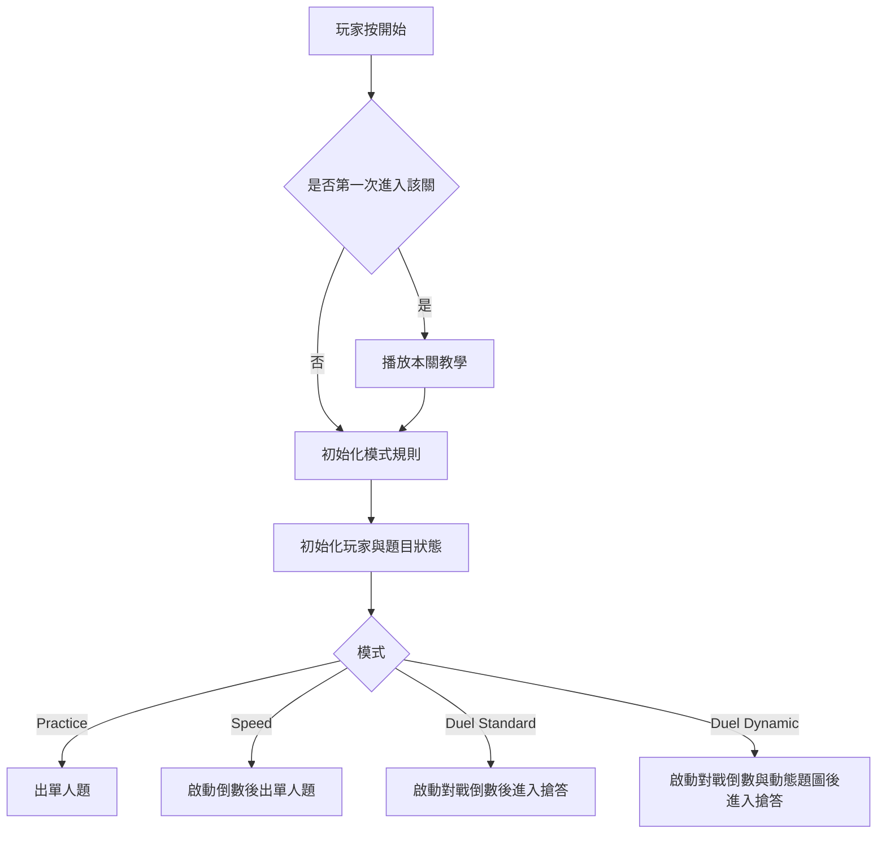
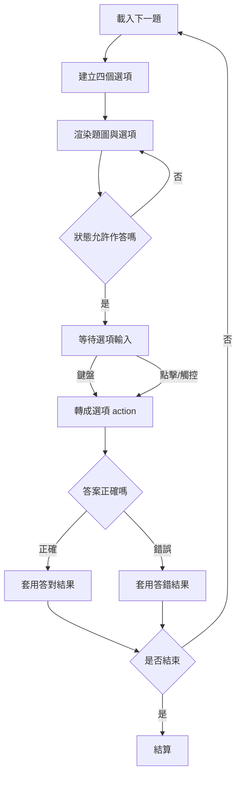
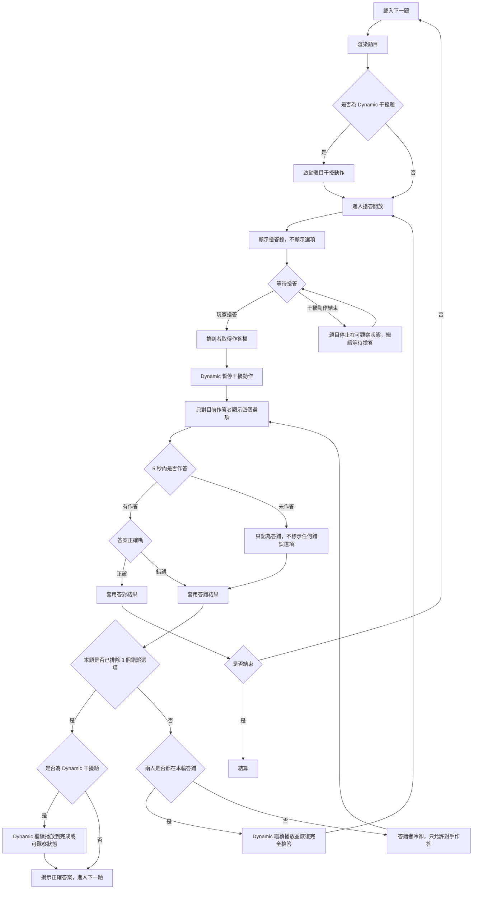
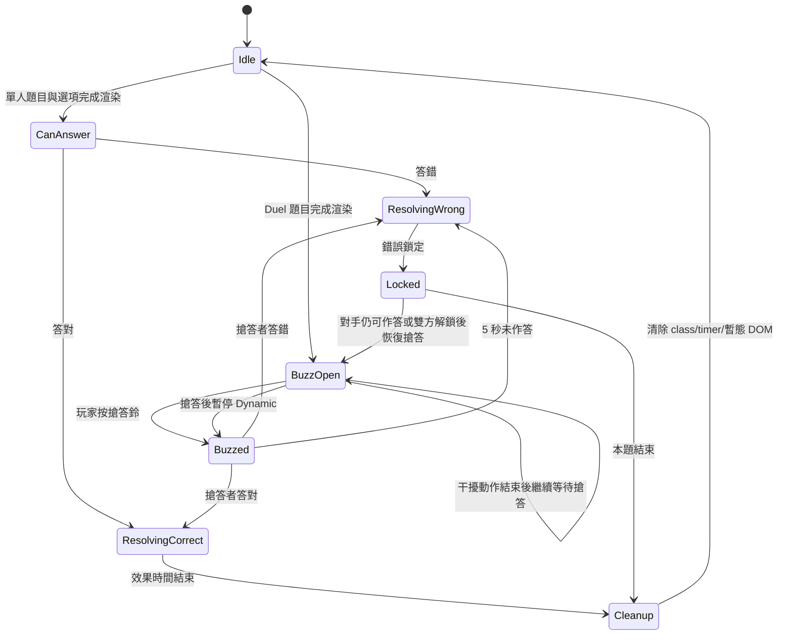

# 有機分類帽 (Organic Sorting Hat)

哈利波特風格的有機化學官能基分類遊戲。玩家看結構式圖片，從四個選項中選出正確的化合物名稱或官能基類別。

本 README 的前半段是目前共識規格，作為後續重構依據；下方 Decision Log 保留歷史紀錄，若與本段衝突，以本段為準。

## 核心目標

- 教學目標優先：幫高中生練習「看結構式辨識官能基」。
- 遊戲回饋要清楚、可預期，不讓動畫或 UI 狀態影響規則判定。
- 所有模式都使用同一套題庫資料與答案判定核心；差異只由模式規則決定。

## 模式規格

| 模式 | 核心目的 | 時間限制 | 作答方式 | 結算目標 |
|---|---|---|---|---|
| Practice 單人練習 | 熟悉題庫與提升正確率 | 無 | 單人四選一 | 答完整關題庫後通關；單輪答對率只作為圖鑑統計 |
| Speed 競速挑戰 | 在壓力下維持準確度 | 有 | 單人四選一 | 時間歸零時結算答對題數 |
| Duel Standard 雙人對戰 | 真正搶答 | 有 | 兩人先搶答，再由搶到者作答 | 先達成勝利條件者勝 |
| Duel Dynamic 雙人動態對戰 | 搶答加視覺干擾 | 題目干擾動作有生命週期，但不等於答題限時 | 題圖先動態干擾，玩家按搶答鈴後才顯示選項 | 先達成勝利條件者勝 |

### 模式細則

- **Practice**：不倒數。每輪 10 題，做完後結算本輪答對率；答對率不決定通關。通關條件是把該關題庫中的所有題目都至少作答過一次。結算後可選擇繼續練習剩餘未出題目，並混入本輪答錯題目，或離開關卡。
- **Speed**：只有倒數時間，沒有血量。初始時間 60 秒；答對加時間、答錯扣時間；時間歸零時結算答對題數。
- **Duel Standard**：靜態題目 + 搶答鈴 + 5 秒作答權。未搶到作答權的玩家不能選答案；若搶到者答錯，搶到者進入冷卻，作答權交給對手。
- **Duel Dynamic**：沿用 Duel Standard 的搶答規則，額外加入題目圖片動態變化作為干擾。Zoom 只是第一種干擾變體；未來可加入其他干擾方式，但不需要新增玩法模式。
- **Level 99**：答案是英文官能基類別，不是化合物名稱。



## 題目與關卡

題目以圖片為核心，每題四個單選標籤。題庫依 Level 分級，從 `QuestionSets[currentLevel]` 抽題，答案內容來自 `AnswerBank`。

| Level | 主題 |
|---|---|
| 1 | 碳氫骨架（烷/烯/炔/芳香） |
| 2 | 單鍵氧家族（醇/醚） |
| 3 | 雙鍵氧家族（醛/酮） |
| 4 | 雙氧複合（酸/酯） |
| 5 | 雜原子與鹵素（胺/鹵化物） |
| 6 | 綜合題（Level 1~5 混合） |
| 龜殼 | 「龜殼」與它的產地：苯環陷阱關。全是含苯環化合物，要看苯環上接什麼官能基 |
| 99 | 資優全英挑戰（看圖選英文分類） |

## 答題流程

Practice / Speed 的題目流程是「先顯示題目與四個選項，再等待作答」。Duel 模式的題目流程是「先顯示題目與搶答鈴，取得作答權後才顯示選項」。

輸入只產生 action，規則層判定 action 是否有效，UI 只根據結果顯示畫面。



### Duel 搶答流程

Duel Standard 與 Duel Dynamic 都使用搶答鈴。Dynamic 題型在搶答前只顯示題目與干擾動作，不能先讓玩家看到四個選項。

作答權倒數未完成作答時，算一次作答失敗，但不算選錯某個選項；因此不排除任何選項，也不揭露任何錯誤選項。



<!--
舊版單一答題流程保留在 git 歷史中。Duel Dynamic 不可先顯示選項，否則會破壞「觀察題目後搶答」的設計。
-->

## 效果生命週期

答對、答錯、搶答、鎖定、攻擊、提示都必須有明確生命週期。任何新題開始前，上一題的暫態效果必須清除。



### 答對效果規格

- 立即標示正確選項。
- 播放答對音效一次。
- 更新分數、時間、combo、進度或答對數。
- 效果結束後才進入下一題或結算。
- 下一題開始前必須清除正確高亮與所有暫態動畫。

### 答錯效果規格

- Practice：只標示玩家選錯的選項，不亮起正確答案；提示可用文字說明辨識方向。
- Speed：立即標示錯誤選項，並可顯示正確答案。
- Duel：答錯時只標示該次作答失敗，不揭示正確答案；只有同題達到最大錯誤次數時才揭示正解。
- 播放答錯音效一次。
- 根據模式套用時間變化、鎖定、提示或懲罰。
- 鎖定期間不可重複作答。
- 鎖定結束或新題開始前必須清除錯誤高亮、正解提示、警告文字與鎖定 class。
- 若是 Duel 搶答後 5 秒未作答，僅記為作答失敗與冷卻，不得隨機標示某個錯誤選項，也不得透露哪個選項錯。
- 未作答逾時不算選錯某個選項；只有玩家實際選到錯誤選項時，才計入「已排除錯誤選項」。

### Combo / Streak 規格

- `correctStreak` 跨題累積，直到答錯、逾時作答失敗、重開關卡、回主選單或結算時歸零。
- `wrongStreak` 可跨題累積，用於 Practice 提示或 Speed 壓力機制；答對時歸零。
- Practice 中，連錯主要用於提示與教學回饋，不應造成玩家死亡。
- Speed 中，連對與連錯可影響分數或時間，但具體數值需由模式規則定義。
- Duel / Dynamic 中，combo 只建議作為視覺表現或戰況提示，不應改變搶答權與答案判定。

### 搶答效果規格

- Duel 模式進入搶答期前，任何答案選項都不可直接作答。
- 第一個有效輸入者取得作答權。
- 搶到者才看到選項並可作答；另一位玩家不可作答。
- 若搶到者答錯，該玩家進入冷卻，作答權交給對手。
- Duel Dynamic 中，玩家按下搶答鈴後，題目干擾動作暫停；若該玩家答錯或 5 秒未作答，作答權自動交給對手，Dynamic 仍維持暫停。
- 若對手也答錯或 5 秒未作答，且尚未達到本題揭示門檻，Dynamic 繼續播放並恢復完全搶答，兩邊都可再次按搶答鈴。
- Duel 的錯誤選項排除狀態由雙方共享；任一玩家實際選錯某個選項後，該選項視為本題已排除。
- 同一題若已排除 3 個錯誤選項，Dynamic 題型需先讓干擾動作播放到完成或可觀察狀態，再揭示正確答案並進入下一題。
- Dynamic 題型的干擾動作結束後，不顯示答案；題目停在可觀察狀態，繼續等待玩家搶答。

### Dynamic 干擾規格

- Dynamic 是一類對戰變體，不是一個固定等於 zoom 的模式。
- 每個 Dynamic 變體都必須定義 `completeState`，代表玩家已能完整觀察題目。
- 例：Zoom 變體的 `completeState` 是圖片已 zoom out 到能看到完整結構。
- 當需要揭示正確答案時，Dynamic 必須先到達 `completeState`，再揭示答案。

## UI 與規則邊界

- 規則狀態以資料為準，例如 `currentMode`、`players[player].state`、`buzz.phase`、`question.current`。
- DOM class 只能反映狀態，不能成為規則來源。
- `setTimeout` 只能負責效果生命週期，不能單獨決定遊戲勝敗。
- 新題開始、重開關卡、回主選單、結算時，都必須走統一 cleanup。
- UI 渲染函式只接受狀態並畫畫面，不直接改變勝敗、解鎖、分數或存檔。
- 在任何答對 / 答錯 / 揭示答案 / 切題動畫期間，必須啟用全局輸入鎖定，封鎖所有答題鍵與點擊，直到新題目準備就緒。
- 全局輸入鎖定期間不接受答題輸入；若玩家按 `Esc`，只開啟暫停 / 確認離開，不直接離開遊戲。
- 重開本關或返回大廳都屬於破壞目前題目流程的動作，必須先確認；確認後才執行 cleanup 並切換畫面。
- 顯示確認視窗期間，timer、Dynamic 干擾動作與作答倒數都必須暫停；取消確認後，恢復到原本狀態。
- 玩家按 `Esc` / `M` 時，跳出「確定返回大廳？」確認視窗；選確認才 cleanup 並返回大廳，選取消則回到剛剛的遊戲狀態。

### Cleanup 定義

Cleanup 是「清除暫態狀態」，不是一個玩法決策。它不等於放棄本題、跳下一題或離開遊戲；實際去向由呼叫 cleanup 的流程決定。

Cleanup 必須清除：

- 尚未完成的 `setTimeout` / interval。
- 答對、答錯、揭示答案、冷卻、搶答、Dynamic 暫停等暫態 class。
- 臨時 DOM，例如倒數、警告、攻擊特效、提示泡泡。
- 玩家暫態鎖定，例如 `globalInputLocked`、單一玩家冷卻、作答權狀態。

Cleanup 之後可能接：

- 下一題。
- 結算畫面。
- 重開本關。
- 返回大廳。

## 通關、進度與存檔規則

- Practice 是唯一會解鎖劇情的模式。
- Practice 每輪 10 題；本輪答對率需記錄，並在圖鑑中可查看，但不作為通關門檻。
- Practice 通關條件是「該關題庫中的所有題目都至少作答過一次」；通關後解鎖該關劇情。
- Practice 結算後，玩家可選擇繼續練習：題池包含尚未出現的題目，並加入本輪答錯題目。
- Practice 的單次答對率與題庫完成度需記錄，並在圖鑑中可查看。
- Speed 不計入圖鑑解鎖，不解鎖劇情。
- Duel / Dynamic 答對不計入總答對數，不解鎖圖鑑，不解鎖劇情。
- 勳章與總答對數只統計 Practice，除非未來另行定義。

## 模式參數

以下數字是目前新規格，重構時應落實到 `mode-rules.js`，不要沿用舊程式中的歷史值。

| 參數 | 目前方向 |
|---|---|
| Practice 每輪題數 | 10 題 |
| Practice 通過正確率 | 無門檻；答對率只作為圖鑑統計 |
| Practice 解鎖劇情門檻 | 該關題庫全部題目都至少作答過一次 |
| Speed 初始時間 | 1 分鐘 |
| Speed 時間數值 | 初始 60 秒，只使用時間，不另設血量；UI 也只顯示時間 |
| Speed 答對時間變化 | +3 秒 |
| Speed 答錯時間變化 | -3 秒 |
| Speed 結束條件 | 時間歸零時結算 |
| Duel 勝利條件 | 先答對 5 題 |
| Duel 作答權倒數 | 5 秒；逾時算作答失敗，不排除選項、不揭露錯誤選項 |
| Duel 答錯懲罰 | 答錯者冷卻，作答權交給對手 |
| Duel 單題揭示門檻 | 已排除 3 個錯誤選項後，Dynamic 播放到完成或可觀察狀態，再給答案 |
| Dynamic 干擾變體 | Zoom 是第一種；未來可新增其他干擾方式，不新增玩法模式 |
| Dynamic 干擾動作結束後 | 題目停止在可觀察狀態，繼續等待搶答，不自動揭示答案 |

## 輸入規格

- 單人模式：滑鼠 / 觸控，或鍵盤 `A/F/Z/C`、數字鍵 / 小鍵盤 `4/6/1/3`，對應畫面 2x2 選項位置。
- Duel 桌面模式：P1 使用 `A/F/Z/C`，P2 使用數字鍵 / 小鍵盤 `4/6/1/3`。
- Duel 觸控模式：玩家用各自區域點擊或觸控搶答與作答。
- 遊戲中：`Esc`/`M` 開啟「確定返回大廳？」確認，`R` 開啟重新開始本關確認，`H` 切換 Practice 提示模式。
- 結算畫面：`Enter` 確認目前焦點按鈕，`N` 到下一關，`R` 再次練習，`S` 解鎖/重播劇情，`T` 看本關教學，`Esc`/`M` 返回大廳。
- 主選單：`1-6` 開 Practice Level 1-6，`7` 開龜殼關，`9` 開 Level 99，`Q/W/E` 開 Speed，`U/I/O` 開 Duel，`T` 新手導覽，`C` 圖鑑，`H` 看分類總表（若有）。
- 方向鍵可在目前畫面中的按鈕間移動焦點，`Enter`/`Space` 執行。

## 周邊系統

- **分類帽角色**：作為教學與回饋角色，但表情動畫不得控制遊戲規則。
- **新手導覽**：首次進站自動跳出，可在首頁重看。
- **每關分類帽教學**：第一次進關先播放，完成後才開始遊戲；可在結算畫面重看。
- **提示模式**：只在 Practice 中啟用，答錯時提供辨識提示。
- **圖鑑**：顯示已通過關卡、已看過分子、小知識、劇情與梗圖。
- **劇情**：Practice 完成該關全部題庫後解鎖；結算頁可播放。
- **勳章**：累積答對達門檻時解鎖。
- **存檔**：自動存在瀏覽器 localStorage，可匯出、匯入、重置。

## 重構方向

目前 `game.js` 是歷史累積的主控制器。後續重構目標不是只把檔案切小，而是先把規則、狀態、渲染、效果生命週期拆清楚。

```text
game.js             流程協調入口
mode-rules.js       Practice / Speed / Duel / Dynamic 的資料化規則
game-state.js       玩家、題目、timer、buzz 狀態
question-engine.js  抽題、選項生成、答案判定
effect-manager.js   答對/答錯/鎖定/搶答/清理效果
input.js            鍵盤、滑鼠、觸控轉成 action
render.js           依狀態渲染畫面
```

## 新增分子

原始圖庫有 38 個化合物；2026-05-11 已依 `assets/images/題庫擴充建議.md` 的「第一批：補滿現有家族」新增 43 個 SVG 與題庫資料，總數 81 個。

教學主軸維持 13 類，**不另開官能基家族關卡**；但 2026-05-12 決議新增一個「**其他（暫未收錄的官能基）**」桶——把段考會出、但不在這 13 類的單官能基化合物（醯胺、硝基、腈…）歸到「其他」，讓學生至少知道「這個我們還沒教」而不是亂猜。多官能基的複雜藥物分子（阿斯巴甜、紫杉醇等）一律不收。

| 類別 | 新增項目 |
|---|---|
| 烷烴 | 丁烷、異丁烷、環己烷、環丙烷 |
| 烯烴 | 2-丁烯、1,3-丁二烯、環己烯 |
| 炔烴 | 1-丁炔、2-丁炔 |
| 醇 | 2-丙醇、第三丁醇、乙二醇、丙三醇（甘油）、環己醇 |
| 醚 | 甲乙醚、環氧乙烷、苯甲醚 |
| 醛 | 丁醛 |
| 酮 | 2-戊酮、3-戊酮、環己酮、苯乙酮 |
| 羧酸 | 丁酸、草酸 |
| 酯 | 乙酸異戊酯、丁酸乙酯、苯甲酸甲酯 |
| 胺 | 三甲胺、乙二胺 |
| 鹵化物 | 二氯甲烷、三氯甲烷（氯仿）、碘甲烷、氯乙烯 |
| 芳香烴 | 鄰-二甲苯、間-二甲苯、對-二甲苯、乙苯、萘 |
| 酚 | 鄰-甲酚、間-甲酚、對-甲酚、兒茶酚、間苯二酚 |

## 專案結構
```
index.html          主頁面（GitHub Pages 入口）
game.js             目前的遊戲主控制器；待重構為流程協調入口
data.js             答案庫 AnswerBank + 各關題庫 QuestionSets + 化合物小知識 CompoundFacts
story.js            各關劇情腳本 StoryScripts
tutorial.js         每關「分類帽教學」投影片 LevelTutorials（第一次進關自動跳）
save.js             本地存檔模組（localStorage）
style.css           樣式
assets/images/      化合物 SVG 結構式（按官能基分資料夾）+ 00_functional_groups/（14 張純官能基示意圖，教學用）+ character/（分類帽圖）+ icons/（UI 圖示）+ meme/（梗圖）
docs/               設計與討論文件（設計決策清單、化學審查清單、AI 協作記錄等）
prototypes/         實驗 / 早期測試頁（hat-demo、wizard-prototype、test、testquestion）
examples/           範例存檔（full-unlock-save.json：全部通關，匯入即可測試圖鑑）
```

## 部署到 GitHub Pages
1. 把整個 repo push 到 GitHub。
2. Repo → Settings → Pages → Source 選 `Deploy from a branch`，branch 選 `main`、資料夾 `/ (root)`。
3. 幾分鐘後可在 `https://<帳號>.github.io/<repo>/` 開始玩（`index.html` 會自動當首頁）。
> 只有 `index.html` + `*.js` + `style.css` + `assets/` 是執行必需；`docs/`、`prototypes/`、`examples/` 可留可不留，不影響遊戲。

---

## 📒 開發決策日誌 (Decision Log)

> 每次重要決定 / 變更都記在這裡，方便回溯「為什麼這樣做」。

### 2026-05-11 — GPT × Claude 評估討論

**已裁決（使用者拍板）**
- ✅ **A1 `confused` 類別移除**：phenol、benzyl_alcohol、benzaldehyde、benzoic_acid、aniline 改回真正的官能基分類（phenol→自成一類、benzyl_alcohol→alcohol、benzaldehyde→aldehyde、benzoic_acid→carboxylic、aniline→amine）。化學上已確認 OK。
- ✅ **A2 phenol 自成一類**：新增 `category: "phenol"`，與 Level 99 的 `CAT_PHENOL` 一致。
- ✅ **A3 Level 6 正名**：Level 6 本意是「Level 1~5 綜合題」，「易混淆」用詞改成「**綜合題**」。需同步改 `index(organic).html` 選單文字與相關說明。
- ✅ **正確性 > 體驗**：教學遊戲，先修資料正確性再優化體驗（GPT、Claude、使用者三方共識）。

**已裁決（續）— Duel 模式版面看設備分支**
- ✅ 桌面：兩玩家**共用一組選項按鈕**（不旋轉、不分割），P1 按左區鍵（ASDF / 1234）、P2 按右區鍵（JKL; / 7890）。放棄 Shift+ABCD 方案。
- ✅ 手機：維持現狀（上下分割、P2 半邊旋轉 180°、各自題目+選項、觸控）。
- → `setupLayout()` 要改成偵測 `matchMedia('(min-width:900px) and (pointer:fine)')` 分 `.duel-desktop` / `.duel-mobile`。與「鍵盤快捷」「桌面 RWD」合併處理。

**已裁決（續）— 趣味化 / 範圍 / 題庫**
- ✅ **題庫一圖多畫法**：⏸ 暫不做（產圖困難 + 教學目標單一化為「辨識官能基」，別用其他畫法混淆）。未來只放「進階 Level」。
- ✅ **不再新增官能基家族**：教學範圍維持現有 13 類（含新拆 phenol）。醯胺/硝基/腈/酸酐/醯氯 都不收。
- ✅ **圖鑑收集** 要做（答對解鎖化合物卡 + 家族徽章）—— 目前架構沒有，需新建。
- ✅ **對戰玩法** 要做，但**做成獨立 Level（不破壞原玩法）**，且**先不做「反應組合技」**——教學目標限縮為「分類 / 辨識名稱 / 辨識結構」三件事。
- ✅ **練習模式答錯給「為什麼」提示** 要做，但提示內容還要再想。
- ✅ **答錯回顧功能**：目前沒有，需要加（讓玩家事後複習答錯的題）。

**已修正 / 已實作（程式，2026-05-11 第一批）**
- 🐛 修「『試管破了』警告卡住 + 選項變灰無法點」的 bug：起因是答錯冷卻清理寫在 `setTimeout(... if(gameActive))` 裡，若該次答錯導致 HP 歸零、遊戲結束，清理被跳過且 `startGame()` 沒重置。已改為：`lockTimers` 追蹤計時器、清理不再用 `gameActive` 守衛、`startGame()` / `renderQuestion()` 主動清掉殘留警告與 `locked-area`。同時修正 warn 文字被永久改成「試管破了」、害競速倒數警告也跟著變的副作用。改在 `game(organic).js`。
- ✅ **A1 / A2 已實作**：`data(organic).js` 5 個苯環衍生物改回真正官能基（phenol→`phenol`、benzyl_alcohol→`alcohol`、benzaldehyde→`aldehyde`、benzoic_acid→`carboxylic`、aniline→`amine`）。
- ✅ **A3 已實作**：`index(organic).html` 選單 "Level 6: 終極分類帽 (易混淆)" → "(綜合題)"；`data(organic).js` 相關註解一併更新。
- ✅ **抽題去重已實作**：`nextQuestion()` 改用洗牌佇列（一輪內不重複，發完再重洗，換關卡 / 重開時重建），並避免新一輪首題 == 剛出過的題。
- ✅ **`generateOptions()` 篩選已修**：一般關卡的干擾選項只從「目前關卡 + 之前關卡學過的分子」抽（不再冒出還沒教的化合物），且**優先抽同一關卡的分子**（同關卡官能基較接近、較有鑑別度）；Level 99 維持從英文類別卡抽。
- 🧪 **`wizard-prototype.html`**：Duel 視覺打架的 emoji/CSS 雛形（蓄力→⚡飛出→命中爆+火花、被擊中閃白彈飛、答錯=自己施法失敗冒煙、螢幕震動、HP 掉血、combo 放大）。用來驗證手感，未整合進正式遊戲。
- 📄 **`化學審查清單.md`**：把需要化學專業判斷的部分（confused 重新分類、答錯「為什麼」13 類文案草稿、官能基相似度表草稿、Level 99 英文用語）整理給化學老師審。

**待裁決 / 進行中**
- ⏳ **C11 資料結構重構**：GPT 提議拆兩層、Claude 反對（認為現狀已是兩層）。Claude 折衷案：不做大重構，只做小手術（`cat` 詞條獨立成 `CategoryBank`）。→ 等 GPT 回應。（注：`generateOptions()` 篩選那塊已先修了，不必動結構。）
- ⏳ **C10 UI / 功能盤點**：確認「該有的按鈕都有、該有的說明都有、該有的功能都有」，不必要的提出討論。→ 待執行盤點。
- ✅ **題庫擴充第一批已加入**：見下方「新增分子」；`test.html` 會從 `data(organic).js` 的 `QuestionSets` 顯示新增 SVG。
- ⏳ **答錯「為什麼」提示內容**：草稿在 `化學審查清單.md`，待化學老師潤飾。
- ⏳ **Duel 視覺正式版**：emoji 雛形驗證後 → 決定是否畫真立繪 / 加音效 / 整合進對戰流程。
- ⏳ **B 區設計項**（尚未拍板）：HP 數值分模式調整、對決時間到改比分數、練習模式隱藏時間條 + 顯示本輪進度、答錯高亮正解 + 顯示「為什麼」、答錯回顧畫面、圖鑑收集、對戰獨立 Level、鍵盤快捷、桌面 RWD、錯題優先重出。

### 2026-05-11 — §0 定位 Pillar 定案

> 詳見 `設計決策清單.md` §0。一句話：給**高中生**的有機官能基「快速辨識」練習遊戲（看結構式 → 分類），電腦與手機都要版面友善；成功標準依序為 (1) 學生學會分類 (2) 有趣到願意主動一直練。衝突時「學會 > 好玩」，但「無聊到沒人玩」也算失敗。所有後續取捨以此為裁判。

### 2026-05-11 — §17 存檔模組建立（`save(organic).js`）

> 純前端 localStorage 存檔模組，已在 `index(organic).html` 載入；尚未接進遊戲流程。`Save` 物件：`addCorrect`（累積答對數 + 自動檢查解鎖勳章，回傳新勳章）、`recordWrong`/`clearWrong`（錯題佇列）、`seeMolecule`/`unlockProperty`/`unlockMeme`（三類圖鑑）、`markLevelClear`（順帶解鎖該關劇情）、`recordBest`、`exportText`/`importText`/`reset`、查詢類（`knows`/`isStoryUnlocked`/`wrongList`…）。含 `BADGE_DEFS` 草稿（答對 10/50/200/500/1000 題）。localStorage 失敗（私密視窗/容量滿）會退回記憶體模式，不讓遊戲掛掉。下一步：把 `Save` 接進 game.js 流程 + 做圖鑑/勳章 UI。

### 2026-05-11 — §2 三模式定位 定案（連帶調整 §6 / §8）

> 詳見 `設計決策清單.md` §2。
- **三模式各司其職、只有 Duel 有輸贏**：Practice＝教（**無死亡**，練完一輪題庫結算，可再來）；Speed＝測（倒數 60 秒，**無死亡**，答對 / 連對**加回秒數** → 仍會結束）；Duel＝競技（**各自題目流**，答對不等對方往下，**先答對 N 題（暫 8）勝**；每題 **~1.5 秒閱讀期**鎖按鈕，答錯鎖 2 秒；HP→「到 N 題」進度視覺＋打架特效）。
- **Duel 公平性對策**：各自題目 + 閱讀期 → 不是純比反應（要先看懂結構式才按得對；每題至少 1.5 秒，壓住純手速上限）。
- **連帶影響 §8**：Duel 改各自題目 ⇒ 桌面版「共用一組選項」作廢，改成「左右兩塊、各自題目+選項」（鍵位 P1=`A/F/Z/C` 配左格、P2=`4/6/1/3` 配右格 仍適用）；手機版維持上下鏡像。已記為「給 Codex 的修正」。
- **連帶影響 §6**：Practice/Speed 取消 HP 死亡 ⇒ 原本「對新手太狠」的問題基本消失；剩 Speed 加秒公式、Duel 的 N / 閱讀期 / 鎖秒等數字待 playtest。

### 2026-05-11 — §5 留存 + §16 劇情 + 視覺準則 定案

> 詳見 `設計決策清單.md` §0/§4/§5/§16/§17。
- **§5 留存鉤子**：(1) 進度可見「已認得 X/Y 種」+ Level 完成度；(2) 錯題系統（記錄→優先重考→攻克✓）；(3) 個人累積計數＝累計答對題數（非最高分、非正確率）→ 解鎖勳章，Duel 不計入；(4) 三類圖鑑：分類 / 性質用途 / 化學迷因梗圖。暫不做 streak、排行榜。全部純前端 `localStorage`，**做匯出 / 匯入存檔（明碼 JSON，先不加密）**，需要的參數都寫進去；存檔結構草案見 `設計決策清單.md` §17。
- **§16 劇情系統（格式定）**：每關綁一段短劇情＝約 10 句「分類帽 ↔ 魔法師」對答（內容參考課本），不長、可跳過；解鎖條件＝該關「答對率達門檻」（防亂猜，Duel 不論誰贏只要一方達標即解鎖）。`StoryScripts` 結構草案見 `設計決策清單.md` §16。文案待寫。
- **§4 分類帽教練**：Practice 模式加吉祥物角色（🎩），開場帶人 / 答對鼓勵 / 答錯講「為什麼」/ 卡關給提示。語氣與台詞待定。
- **視覺準則（全域）**：不做全螢幕亮暗閃光 / 高對比爆閃；衝擊感改用色彩光暈＋粒子＋位移＋輕微震動。`wizard-prototype.html` 已移除白光爆閃。
- **占位準則**：所有缺美術的圖先用 emoji 示意。

### 2026-05-11 — Claude / Codex 分工建議（待使用者確認）

- **Claude（已做完，這批可請 Codex 測試）**：bug 修復、A1~A3 資料、抽題去重、`generateOptions` 篩選、wizard 雛形、化學審查文件。
- **建議分給 Codex 的下一批**（彼此獨立、不會跟上面衝突）：
  - 鍵盤快捷（2x2 空間配置：左側 `A/F/Z/C`、右側 `4/6/1/3`）+ Duel 桌面 RWD（`setupLayout` 依設備分支）— 已實作，待實機測。
  - 或：答錯高亮正確答案 + 練習模式答錯顯示「為什麼」（文案先用 `化學審查清單.md` 草稿）+ 結束畫面「錯題回顧」— 一組相關的回饋功能。
- **流程**：Codex 做的，Claude 測；Claude 做的，Codex 測。指令由使用者轉達（Claude 無法直接指揮 Codex）。
- **共識守則**：教學目標限縮在「分類 / 辨識名稱 / 辨識結構」；不新增官能基家族；不做「反應組合技」；不為公平性加人工輸入延遲。

### 2026-05-12 — 內容方向（其他桶 / 新手教學 / 課本式文案 / 龜殼關）

> 規劃討論結論。背景：使用者覺得現有「為什麼」/ 圖鑑文案對「從沒學過有機的學生」不夠友善，會挫折；且已自製好一批「純官能基結構圖」放在 `assets/images/00_functional_groups/`（14 張 fg SVG），希望教學從「結構圖」下手而非文字硬背。

**已裁決**
- ✅ **新增「其他（暫未收錄的官能基）」桶**：段考會出、但不在 13 類內的**單官能基**化合物（醯胺、硝基、腈…）歸到「其他」。化學上 OK 的前提：標籤要明示「**非本課範圍**」、不可暗示「這分子沒有官能基」（醯胺/硝基明明有官能基）；不要當垃圾桶亂塞，某類分子累積夠多再「畢業」成獨立關。**多官能基藥物分子（阿斯巴甜、紫杉醇、阿司匹靈、柳酸、魯米諾、多巴胺…）一律不收。**
- ✅ **每關「分類帽新手教學」— 已實作（2026-05-12）**：新增 `tutorial.js`（`LevelTutorials[levelKey] = [{ img, title, text }, …]`，img 可為單一路徑或陣列、可省略；附一句一句的編輯說明，給非程式者改）；`game.js` 把 tutorial modal 一般化（`_tutSlides`/`_tutOnClose`/`_tutDoneLabel`、`_tutRender` 支援 `img` 渲染圖片、新增 `showLevelTutorial(levelKey, onDone)`、modal 標題動態化）；`startGame` 拆成 `startGame`（先檢查 `Save.isLevelTutorialSeen` → 第一次進關先播教學，看完再 `_doStartGame`）+ `_doStartGame`（原本的開局流程）；結算畫面加「📖 看本關教學」按鈕（`btn-show-tutorial`，鍵 `T`）可重看；`save.js` 加 `levelTutorialsSeen: []` + `markLevelTutorialSeen`/`isLevelTutorialSeen`（migrate 自動補）；`style.css` 加 `.tutorial-img`（單張大、`.multi` 並排縮小）；`examples/full-unlock-save.json` 補上 `levelTutorialsSeen` 全關卡 + `levelShell` 通關。文案是開發團隊寫的「零基礎友善」版（structure-first、不堆術語），之後可換成 NotebookLM/老師的課本式版本。這同時補上 §3 onboarding 與 §4「分類帽教練」。
- ✅ **文案走「貼近課本用語」路線**：「為什麼」提示 / 新手教學 / 劇情文案的底稿改由 **NotebookLM**（已讀使用者上傳的高中化學課本，輸出本身就是課本衍生轉述）整理 → 再進 `化學審查清單.md` 給老師審。**不需要我們手上有課本 PDF**。給 NotebookLM 的指令要明寫「寫給零基礎學生、要具體舉例、不要堆術語」。
- ✅ **新關卡「龜殼與它的產地」（苯環陷阱關）— 已實作**：`data.js` 新增 `LevelShell_List`（19 題，全是含苯環的化合物：苯酚/3 種甲酚/兒茶酚/間苯二酚/苯甲醇/苯甲醛/苯甲酸/苯胺/苯乙酮/苯甲酸甲酯/苯甲醚/氯苯/苯/甲苯/苯乙烯/鄰二甲苯/萘——全部沿用既有 SVG，零新圖），`QuestionSets.levelShell`。`game.js`：`LEVEL_INFO`/`LEVEL_ORDER`（排在 level6 與 level99 之間）各加一筆、`MENU_SHORTCUTS` 加 `Digit7`、`generateOptions` 修成「非主線關卡的干擾選項先從本關自己的分子抽」（這樣龜殼關的干擾項都是其他苯環衍生物 → 強化陷阱）、`startGame` 的關卡標題改成有 `titleShort` 就用它（龜殼關顯示「龜殼之地」而非「LEVELSHELL」）。`index.html` 三個模式各加一顆按鈕。`story.js` 加 `levelShell` 9 句劇情（毒舌帽風格，{name} 占位）。`prototypes/test.html` 會自動列出新關卡題庫。
- ✅ **反向題型（題目=文字、選項=結構圖）= 中等改動，列近期獨立任務**：資料結構已鋪好路（`AnswerBank` 每筆有 `type`、每題有 `qType`，目前全是 `text`/`img`）；要改 `game.js` 三處硬編碼（`renderQuestion` 題目區、選項按鈕渲染、`getOptions` 干擾池）。做好之後「圖鑑實驗現象關 / 鑑定之眼」才有載體。先做完低風險的（其他桶 / 新手教學 / 龜殼關 / 課本式文案）再開這一輪。

**現階段不做（列未來）**
- ⏸ **同分異構物關**（玩法要從「分類」改成「公式搜查 + 關係鑑定」，需 multi-select / 不飽和度判定）。
- ⏸ **藥物拆解關**（multi-select 點選複雜分子上的所有官能基，需複雜分子 SVG 重產）。

**待辦**
- [ ] 「其他」桶要收哪些分子的最終清單（草案見下節 / `化學審查清單.md §7`，SVG 已生 15 張在 `assets/images/15_amide/`…`19_acyl_chloride/`）→ 老師審完後接進 `data.js`（`AnswerBank` 加 `category:"other"` + 一個「其他」答案 + 編進關卡）。
- [ ] NotebookLM 整理「課本式」的：13 類「為什麼」辨識提示、每關新手教學 2–4 頁文案、各關劇情擴寫（2026-05-12：第一版輸出不堪用，pending；需求包見 `docs/copy_for_notebooklm.json`）→ 拿回來後直接換掉 `data.js` 的 `WHY_HINTS` / `tutorial.js` 的 `LevelTutorials` / `story.js` 裡的字。
- [x] `game.js` modal 擴充支援圖片 + `tutorial.js` 每關教學投影片資料 — 2026-05-12 完成（文案先用開發團隊版）。
- [x] 「龜殼與它的產地」題庫 + 關卡接線（`data.js` / `game.js` / `index.html` / `story.js`）— 2026-05-12 完成。
